# 钱包模块需求文档（充值金币 / 金币明细 / 钻石明细 / 钻石兑换金币）

> 产出依据：
> - 服务端：`/Users/mac/心音跳动/server`
> - 客户端：`/Users/mac/心音跳动/stay-flutter-master-c195b8a02a1f4db5ac09a0a73d726021d2460615`
> - 原型图：
>   - `原型图/金币充值.jpg`
>   - `原型图/金币明细.jpg`
>   - `原型图/钻石明细.jpg`
>   - `原型图/钻石兑换金币.jpg`
>   - `原型图/金币、钻石明细.jpg`（旧版合并图，仅作对照，不作为主描述图）

---

## 一、文档范围

本文档仅保留以下功能需求：

- 金币充值页
- 金币明细页
- 钻石明细页
- 钻石兑换金币页
- 钻石兑换金币确认弹窗

不展开：

- 第三方充值完整页面
- 提现
- 金豆/游戏币相关能力

## 二、页面详细需求


## 6.1 金币充值页

### 6.1.1 页面定位
用于展示用户当前金币余额，并提供标准金币充值入口。

### 6.1.2 对应原型
`/Users/mac/心音跳动/TOPKHLIJ/钱包模块/原型图/金币充值.jpg`

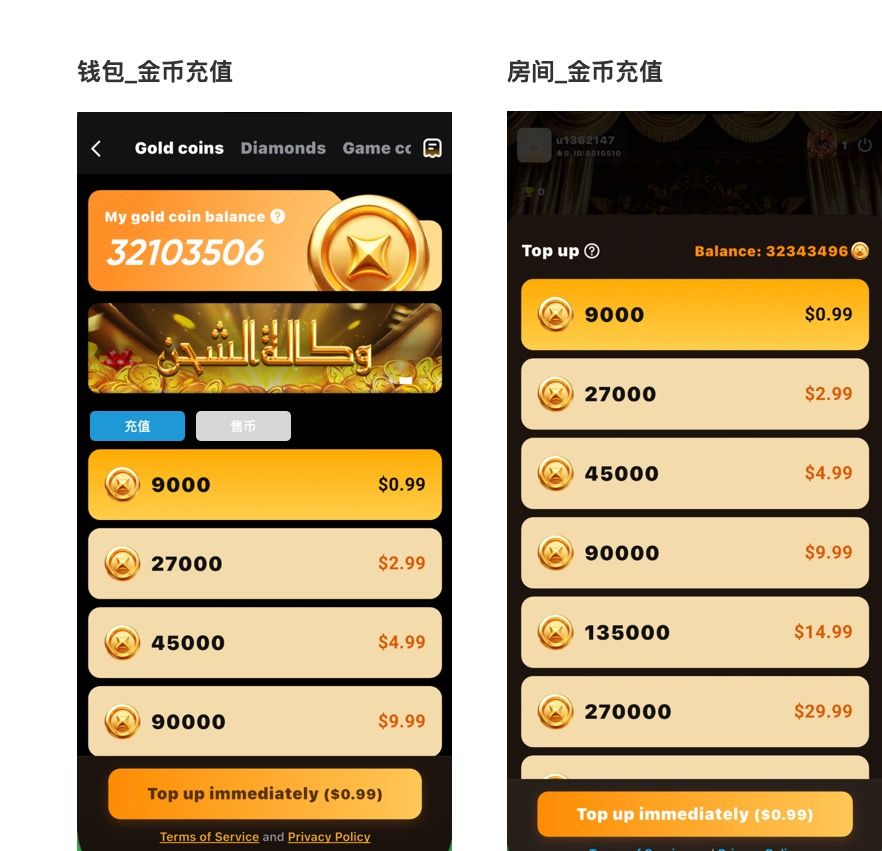

### 6.1.3 前置条件
- 用户已登录
- 用户钱包账户已初始化
- 当前钱包支持展示 `Gold coins` 页签

### 6.1.4 页面字段定义

| 区块位置 | 字段名称 | 定义 | 统计/计算口径 | 数据来源 |
|---|---|---|---|---|
| 顶部 Tab | Gold coins | 当前钱包资产页签之一，当前选中 | 固定页签 | 客户端 Tab 配置 |
| 顶部 Tab | Diamonds | 钱包资产页签之一 | 固定页签 | 客户端 Tab 配置 |
| 顶部 Tab | Game coins | 钱包资产页签之一 | 固定页签 | 客户端 Tab 配置 |
| 余额卡 | My gold coin balance | 当前金币余额标题 | 固定文案 | 客户端多语言 |
| 余额卡 | 金币余额值 | 当前用户金币资产余额 | 读取账户 `userCoins` | 客户端 `GlobalUserCubit` |
| 余额卡 | 规则说明按钮（?） | 查看金币用途/规则说明入口 | 点击打开说明弹层或说明页 | 客户端交互 |
| 活动区 | Banner | 充值活动宣传位 | 按活动配置返回 | 客户端 Banner 数据 |
| 功能切换区 | 充值 | 当前充值模式入口，当前高亮 | 默认高亮 | 原型定义 |
| 功能切换区 | 售币 | 钱包中的币商售币入口 | 切换到币商售币业务分支 | 原型定义 |
| 套餐列表 | 金币数量 | 当前充值套餐到账金币数 | `coin + giveCoin`；若 `giveCoin=0` 则仅展示 `coin` | 充值档位接口 |
| 套餐列表 | 赠送金币 | 当前套餐赠送部分 | 仅当 `giveCoin > 0` 时展示 | 充值档位接口 |
| 套餐列表 | 支付价格 | 当前套餐价格 | 读取 `price` | 充值档位接口 |
| 底部按钮 | Top up immediately ($X) | 当前充值主按钮 | 跟随当前选中档位价格动态变化 | 客户端本地联动 |
| 底部文案 | Terms of Service and Privacy Policy | 协议入口 | 固定文案 | 客户端多语言 |

### 6.1.5 统计/计算口径

| 项目 | 口径 |
|---|---|
| 当前余额 | 读取账户中的 `userCoins` |
| 套餐到账金币 | `coin + giveCoin` |
| 按钮价格 | 当前选中档位 `price` |
| 默认选中 | 默认选中第一条可售卖档位 |

### 6.1.6 交互逻辑

1. 用户进入金币充值页。
2. 页面自动拉取充值档位列表。
3. 默认选中第一个档位。
4. 用户点击其他档位后：
   - 当前卡片高亮切换
   - 底部按钮金额同步变化
5. 用户点击 `Top up immediately($X)` 后：
   - 客户端先请求本次充值授权
   - 服务端返回本次充值 token
   - iOS 拉起 Apple 支付
   - Android 拉起 Google 支付
6. 服务端验单成功后发放金币。
7. 客户端监听金币余额上涨：
   - 视为到账成功
   - 关闭充值弹窗 / 返回原消费场景

### 6.1.7 状态定义

| 状态 | 触发条件 | 页面表现 |
|---|---|---|
| 加载中 | 首次进入，请求充值档位列表 | 档位列表 loading |
| 标准可充值态 | 成功返回档位列表 | 展示余额、Banner、档位、主按钮 |
| 档位选中态 | 用户点击某个档位 | 当前卡片高亮，按钮金额更新 |
| 支付处理中 | 发起支付后尚未到账 | loading，禁止重复点击 |
| 到账成功态 | 金币余额真实上涨 | 自动关闭弹窗 |
| 到账失败态 | 支付失败或验单失败 | 提示失败，可重试 |

### 6.1.8 系统后台核心逻辑

- 系统会先向客户端下发当前可售卖的金币充值档位，用于页面展示充值套餐。
- 用户正式发起支付前，系统会先为本次购买生成一份充值授权，用于锁定本次充值档位、活动资格和购买凭证。
- 不同平台完成支付后，系统会根据平台返回的订单信息做真实性校验，确认这笔支付是否真实有效、是否重复、是否与当前充值档位匹配。
- 当平台确认支付成功后，系统会生成正式充值记录，并把对应金币发放到用户账户。
- 金币到账后，系统会同步触发后续业务，如首充判断、活动奖励判定、到账通知和充值统计更新。

### 6.1.9 第三方充值金币套餐价格公式

当金币充值走第三方充值链路时，服务端对每个套餐的本地支付价格不是直接写死，而是按“美元基础价 + 渠道汇率换算 + 渠道手续费”动态计算。

#### 价格计算总览

| 计算阶段 | 说明 | 是否影响最终支付金额 |
|---|---|---|
| 第一步：确定套餐基础美元价 | 先取当前充值套餐的标准美元价格 | 是 |
| 第二步：确定结算币种 | 根据国家/地区、支付方式和支付渠道确定本次支付币种 | 是 |
| 第三步：确定渠道汇率 | 优先取自定义汇率；未配置自定义汇率时，取该渠道返回汇率 × 1.003 | 是 |
| 第四步：汇率换算 | 按渠道汇率把美元价换算成本地价格 | 是 |
| 第五步：换算固定手续费 | 若固定手续费单位为美元，则需按渠道汇率换算为本地固定手续费 | 是 |
| 第六步：计算手续费 | 根据比例手续费和本地固定手续费计算本次手续费 | 是 |
| 第七步：计算总价 | 本地价格 + 手续费 = 用户实际支付总价 | 是 |
| 第八步：按渠道精度取整 | 最终展示金额按保留小数位向上取整 | 是 |
| 第九步：校验金额范围 | 若超出最小/最大金额限制，则该规则不可用 | 否（影响规则是否可命中） |

#### 定价配置表字段

| 字段名 | 中文含义 | 是否必填 | 示例 | 备注 |
|---|---|---|---|---|
| provider_code | 支付服务商编码 | 是 | payermax / spancash | 服务商即支付渠道 |
| country | 国家/覆盖范围值 | 是 | Egypt / Saudi Arabia / GLOBAL | 覆盖范围直接存国家；如需全局规则可使用 GLOBAL |
| payment_method | 支付方式名称 | 是 | VISA / Mobile Wallets / Fawry / mada | 对应报价单中的 Payment Method |
| payment_method_icon_url | 支付方式图标地址 | 是 | https://xxx/method-card.png | 前端支付方式区展示使用；每个支付方式必须配置图标 |
| payment_currency | 支付币种 | 是 | USD / EGP / SAR | 对应报价单中的 Payment Currency |
| channel_icon_url | 支付渠道图标地址 | 是 | https://xxx/channel-payermax.png | 前端支付渠道区展示使用；每个支付渠道必须配置图标 |
| custom_exchange_rate | 自定义汇率 | 否 | 5.400000 | 若配置则直接使用；若为空则取渠道返回汇率 × 1.003 |
| service_fee_rate | 比例手续费 | 是 | 0.0425 / 0.029 / 0.0395 | 4.25% 存 0.0425 |
| service_fee_fixed | 固定手续费 | 是 | 0 / 2 / 0.3 | 没有固定手续费则填 0 |
| service_fee_fixed_currency | 固定手续费币种 | 否 | USD / EGP | 固定手续费为美元时，必须按渠道汇率换算后再参与计算 |
| amount_scale | 保留小数位 | 是 | 2 | 总价最终展示时使用 |
| min_amount | 最小适用金额 | 否 | 10.00 | 无限制可为空 |
| max_amount | 最大适用金额 | 否 | 5000.00 | 无限制可为空 |
| status | 状态 | 是 | enabled / disabled | 是否启用 |
#### 定价配置表建表 SQL

```sql
CREATE TABLE `payin_fee_rule` (
  `id` BIGINT UNSIGNED NOT NULL AUTO_INCREMENT COMMENT '主键ID',
  `provider_code` VARCHAR(32) NOT NULL COMMENT '支付服务商编码，例如：payermax；服务商即支付渠道',
  `country` VARCHAR(64) NOT NULL COMMENT '国家/覆盖范围值，例如 Egypt、Saudi Arabia；如需全局规则可使用 GLOBAL',
  `payment_method_type` VARCHAR(32) NOT NULL COMMENT '支付方式类型，例如：CARD、WALLET、BANK_TRANSFER、OTC、APPLEPAY',
  `payment_method` VARCHAR(64) NOT NULL COMMENT '支付方式名称，例如：VISA、Benefit、Mobile Wallets、Fawry、mada',
  `payment_method_icon_url` VARCHAR(255) NOT NULL COMMENT '支付方式图标地址，前端支付方式区展示使用',
  `payment_currency` VARCHAR(16) NOT NULL COMMENT '支付币种，例如：USD、EGP、SAR',
  `channel_icon_url` VARCHAR(255) NOT NULL COMMENT '支付渠道图标地址，前端支付渠道区展示使用',
  `custom_exchange_rate` DECIMAL(18,6) DEFAULT NULL COMMENT '自定义汇率；若为空，则取渠道返回汇率 × 1.003',
  `service_fee_rate` DECIMAL(10,6) NOT NULL DEFAULT 0 COMMENT '比例手续费，例如 4.25% 存 0.042500',
  `service_fee_fixed` DECIMAL(18,6) NOT NULL DEFAULT 0 COMMENT '固定手续费金额；没有则填 0',
  `service_fee_fixed_currency` VARCHAR(16) NOT NULL DEFAULT '' COMMENT '固定手续费币种，例如 USD、EGP；固定手续费为美元时，必须按渠道汇率换算为本地固定手续费',
  `amount_scale` TINYINT NOT NULL DEFAULT 2 COMMENT '金额保留小数位，例如 2 表示保留两位小数',
  `min_amount` DECIMAL(18,6) DEFAULT NULL COMMENT '最小适用金额；没有限制可为空',
  `max_amount` DECIMAL(18,6) DEFAULT NULL COMMENT '最大适用金额；没有限制可为空',
  `status` VARCHAR(16) NOT NULL DEFAULT 'enabled' COMMENT '状态：enabled=启用，disabled=停用',
  `created_at` DATETIME NOT NULL DEFAULT CURRENT_TIMESTAMP COMMENT '创建时间',
  `updated_at` DATETIME NOT NULL DEFAULT CURRENT_TIMESTAMP ON UPDATE CURRENT_TIMESTAMP COMMENT '更新时间',
  PRIMARY KEY (`id`),
  UNIQUE KEY `uk_fee_rule` (
    `provider_code`,
    `country`,
    `payment_method_type`,
    `payment_method`,
    `payment_currency`
  ),
  KEY `idx_rule_match` (
    `provider_code`,
    `status`,
    `country`,
    `payment_method_type`,
    `payment_method`,
    `payment_currency`
  )
) ENGINE=InnoDB DEFAULT CHARSET=utf8mb4 COLLATE=utf8mb4_unicode_ci COMMENT='Payin 手续费规则表';
```

#### 定价公式（最终口径）

| 项目 | 中文公式 | 说明 |
|---|---|---|
| 渠道汇率 | 若配置自定义汇率，则渠道汇率 = 自定义汇率；若未配置自定义汇率，则渠道汇率 = 渠道返回汇率 × 1.003 | 1.003 为统一抗汇率波动系数 |
| 本地价格 | 本地价格 = 套餐美元价 × 渠道汇率 | 本地价格按所选渠道汇率结算 |
| 本地固定手续费 | 若固定手续费币种为美元，则本地固定手续费 = 固定手续费 × 渠道汇率；若固定手续费币种已为本地币，则本地固定手续费 = 固定手续费原值 | 固定手续费参与计算前必须先转换为本地币 |
| 手续费 | 手续费 = （本地价格 × 比例手续费 + 本地固定手续费）÷（1 - 比例手续费） | 手续费计算不依赖总价字段本身 |
| 总价 | 总价 = 本地价格 + 手续费 | 用户实际支付金额 |
| 固定手续费为 0 时的手续费 | 手续费 = （本地价格 × 比例手续费）÷（1 - 比例手续费） | 纯比例手续费场景 |
| 固定手续费为 0 时的总价 | 总价 = 本地价格 ÷（1 - 比例手续费） | 纯比例手续费场景 |
| 取整规则 | 最终展示金额按配置中的保留小数位数向上取整 | 建议总价最终取整，手续费 = 总价 - 本地价格 |

#### 适用金额区间联动规则

- 区间判断基准统一为：**最终支付总价**。
- 当 `min_amount` 和 `max_amount` 均为空时，当前规则不做金额区间限制。
- 当仅配置 `min_amount` 时，总价必须 **大于等于** `min_amount`。
- 当仅配置 `max_amount` 时，总价必须 **小于等于** `max_amount`。
- 当同时配置 `min_amount` 和 `max_amount` 时，总价必须落在 **[min_amount, max_amount]** 区间内，且**包含最小值和最大值边界**。
- 在未同时选择支付方式和支付渠道前，固定套餐区默认展示全部套餐。
- 在已同时选择支付方式和支付渠道后，固定套餐展示时，系统必须先按当前国家、支付方式、支付渠道计算每个套餐的总价，只展示总价落在适用区间内的套餐。
- 若已同时选择支付方式和支付渠道后，固定套餐全部不在适用区间内，则固定套餐区展示空态，用户可切换支付方式、支付渠道，或改走自定义金额路径。
- 自定义金额确认后，系统必须先换算总价，再判断是否落在适用区间内；若总价不在适用区间内，则不允许提交订单。

#### 计算示例

##### 示例一：未配置自定义汇率，使用渠道汇率 × 1.003

| 项目 | 数值 |
|---|---:|
| 套餐美元价 | 9.99 |
| 渠道返回汇率 | 5.30 |
| 抗汇率波动系数 | 1.003 |
| 渠道汇率 | 5.30 × 1.003 = 5.3159 |
| 比例手续费 | 4.25% |
| 固定手续费 | 0 |
| 保留小数位数 | 2 |

计算过程：
- 本地价格 = 9.99 × 5.3159 = 53.105841
- 手续费 = （53.105841 × 4.25% + 0）÷（1 - 4.25%） = 2.357178...
- 总价 = 53.105841 + 2.357178... = 55.463019...
- 按 2 位小数向上取整后，总价展示为 55.47
- 最终手续费 = 55.47 - 53.105841 = 2.364159

结论：用户最终支付 **55.47**。

##### 示例二：配置了自定义汇率，直接使用自定义汇率

| 项目 | 数值 |
|---|---:|
| 套餐美元价 | 9.99 |
| 自定义汇率 | 5.40 |
| 比例手续费 | 4.25% |
| 固定手续费 | 0 |
| 保留小数位数 | 2 |

计算过程：
- 渠道汇率 = 5.40
- 本地价格 = 9.99 × 5.40 = 53.946
- 手续费 = （53.946 × 4.25% + 0）÷（1 - 4.25%） = 2.394469...
- 总价 = 53.946 + 2.394469... = 56.340469...
- 按 2 位小数向上取整后，总价展示为 56.35

结论：用户最终支付 **56.35**。

##### 示例三：固定手续费单位为美元，需按渠道汇率换算

| 项目 | 数值 |
|---|---:|
| 套餐美元价 | 9.99 |
| 渠道返回汇率 | 3.75 |
| 抗汇率波动系数 | 1.003 |
| 渠道汇率 | 3.75 × 1.003 = 3.76125 |
| 比例手续费 | 4.25% |
| 固定手续费（美元） | 0.3 |
| 保留小数位数 | 2 |

计算过程：
- 本地价格 = 9.99 × 3.76125 = 37.5748875
- 本地固定手续费 = 0.3 × 3.76125 = 1.128375
- 手续费 = （37.5748875 × 4.25% + 1.128375）÷（1 - 4.25%） = 2.846274...
- 总价 = 37.5748875 + 2.846274... = 40.421161...
- 按 2 位小数向上取整后，总价展示为 40.43

结论：用户最终支付 **40.43**。

#### 给开发、测试、运营的落地口径

| 角色 | 重点关注点 |
|---|---|
| 开发 | 前端不得本地硬编码计算第三方价格；必须以后端返回的本地价格、手续费、总价、币种、渠道汇率说明为准 |
| 测试 | 同一套餐切换国家/地区、支付方式、支付渠道、币种后，必须校验本地价格、手续费、总价、小数位是否同步变化；若配置自定义汇率，则必须以自定义汇率优先 |
| 运营 | 若用户反馈“同一档位价格为什么不同”，应优先核对国家/地区、支付方式、支付渠道、渠道汇率、自定义汇率、比例手续费、固定手续费是否发生变化 |
| 客服 | 用户看到的最终付款金额以第三方页展示值为准，不以套餐基础美元价为准 |

#### 业务解释

- 同一个金币套餐，在不同国家、支付方式、支付渠道和支付币种下，最终支付价格可能不同。
- 同一国家、同一时间下，不同支付渠道可能返回不同汇率，因此用户实际支付的当地货币价格必须以“所选支付渠道返回的汇率”为准进行结算，不得按国家统一汇率或支付方式统一汇率计算。
- 若不配置自定义汇率，则渠道汇率 = 该渠道返回汇率 × 1.003；若配置了自定义汇率，则直接使用自定义汇率。
- 若固定手续费单位为美元，则必须使用所选支付渠道的汇率换算为本地币后，再参与手续费和总价计算。
- 差异来源不是金币数量变化，而是：
  - 渠道汇率不同
  - 自定义汇率是否生效
  - 比例手续费不同
  - 固定手续费不同
  - 小数位保留规则不同
- 因此前端展示的第三方充值价格必须以后端实时返回为准，不能在客户端本地硬编码推算。

### 6.1.10 异常与测试关注点

- 套餐列表为空的空态
- 档位切换后按钮金额不同步
- 支付成功但客户端未及时感知到账
- 重复回调不得重复发币
- 当前原型未独立画出首充特惠 / 今日特价样式，先按标准充值主流程实现
- 第三方充值价格切换国家 / 渠道后必须实时刷新
- 第三方充值价格不得由客户端本地写死计算

### 6.1.11 第三方充值金币页

#### 页面定位
用于承接“通过第三方支付渠道完成金币充值”的场景。该页面区别于客户端内的标准金币充值页：

- 标准金币充值页：以客户端内官方支付主流程为主；
- 第三方充值金币页：以“国家/地区 + 支付方式 + 支付渠道 + 套餐/自定义金额”组合生成待支付订单，再跳转第三方收银台完成支付。

本页的核心作用不是直接在客户端内完成付款，而是：
- 先让用户选择国家/地区；
- 再根据国家展示可用支付方式；
- 再根据支付方式展示可用支付渠道；
- 在未同时选择支付方式和支付渠道前，固定套餐区默认展示全部套餐；
- 在已同时选择支付方式和支付渠道后，再按当前组合过滤固定套餐，或走自定义金额路径；
- 最终生成待支付订单并跳转对应第三方支付页。

#### 对应原型
`/Users/mac/心音跳动/TOPKHLIJ/钱包模块/原型图/第三方充值.jpg`

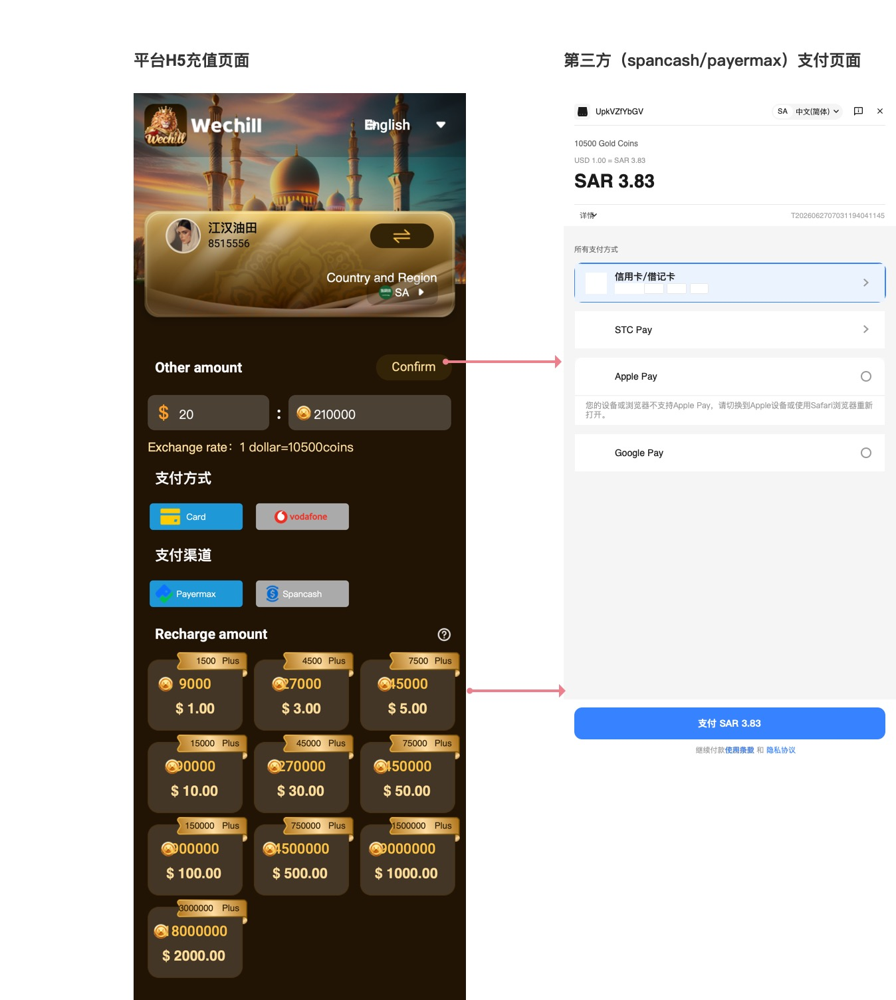

#### 前置条件
- 用户已登录
- 当前账号已进入可使用第三方充值的国家/地区范围
- 当前国家下存在至少一种可用支付方式
- 当前支付方式下存在至少一种可用支付渠道

#### 页面字段定义

| 区块位置 | 字段名称 | 定义 | 统计/计算口径 | 数据来源 |
|---|---|---|---|---|
| 顶部品牌区 | 品牌标识 | 当前平台品牌展示 | 固定展示 | 客户端静态资源 |
| 顶部语言区 | 语言切换 | 当前页面语言入口 | 切换后刷新文案 | 客户端多语言 / 第三方页透传 |
| 用户卡片区 | 用户头像 | 当前登录用户头像 | 直接读取用户信息 | 客户端账户信息 |
| 用户卡片区 | 用户昵称 | 当前登录用户昵称 | 直接读取用户信息 | 客户端账户信息 |
| 用户卡片区 | 用户ID | 当前登录用户编号 | 直接读取用户信息 | 客户端账户信息 |
| 用户卡片区 | Country and Region | 当前充值国家/地区 | 用户选择后生效 | 客户端选择值 / 默认地区 |
| 支付方式区 | 支付方式 | 当前国家支持的支付方式列表 | 由国家维度决定是否展示 | 后端支付方式配置 |
| 支付方式区 | 支付方式图标 | 当前支付方式对应的图标 | 每个支付方式都必须展示服务端配置的图标 | 后端支付方式配置 |
| 支付方式区 | 支付方式选中态 | 当前选中的支付方式 | 单选；切换后刷新支付渠道 | 页面交互 |
| 支付渠道区 | 支付渠道 | 当前支付方式支持的支付渠道列表 | 由“国家/地区 + 支付方式”共同决定 | 后端支付渠道配置 |
| 支付渠道区 | 支付渠道图标 | 当前支付渠道对应的图标 | 每个支付渠道都必须展示服务端配置的图标 | 后端支付渠道配置 |
| 支付渠道区 | 支付渠道选中态 | 当前选中的支付渠道 | 单选；切换后刷新价格结果 | 页面交互 |
| 自定义金额区 | Other amount | 用户自定义输入支付金额 | 输入金额后换算金币数 | 用户输入 + 后端计算规则 |
| 自定义金额区 | 金币数量 | 当前自定义金额对应金币数 | 按当前国家、支付方式、支付渠道组合下的汇率与规则换算 | 客户端展示后端返回值 |
| 自定义金额区 | Exchange rate | 当前美元与金币兑换说明 | 1 美元对应多少金币 | 后端配置口径 |
| 自定义金额区 | Confirm | 确认当前自定义金额并刷新换算结果 | 仅确认金额，不直接生成待支付订单 | 页面交互 |
| 套餐区 | Recharge amount | 固定充值套餐区 | 未同时选择支付方式和支付渠道前默认展示全部套餐；选择完成后按规则过滤展示 | 后端返回套餐数据 |
| 套餐区 | 套餐金币数 | 当前套餐到账金币数 | 直接展示 | 后端返回 |
| 套餐区 | 套餐价格 | 当前套餐基础价格 | 直接展示平台标价 | 后端返回 |
| 套餐区 | Plus标签 | 套餐附加赠送/加量展示 | 按套餐配置显示 | 后端返回 |
| 订单提交区 | 提交充值 | 基于当前已选国家、支付方式、支付渠道、套餐/自定义金额生成待支付订单 | 未选支付方式和支付渠道时不可提交 | 页面交互 |
| 第三方页顶部 | 商品数量 | 第三方收银台展示的充值商品内容 | 根据所选套餐或自定义金额生成 | 订单结果 |
| 第三方页顶部 | 结算金额 | 用户在第三方页实际支付的本地货币金额 | 按第三方价格公式计算 | 后端返回 |
| 第三方页顶部 | 汇率 | 平台标价币种到本地结算币种的换汇关系 | 实时汇率 | 后端返回 |
| 第三方页列表区 | 所有支付工具 | 第三方收银台可用的最终支付工具列表 | 按国家/支付方式/支付渠道返回 | 第三方收银台 |
| 第三方页底部 | 支付按钮 | 发起最终付款 | 按本地货币金额展示 | 第三方收银台 |

#### 统计/计算口径

| 项目 | 口径 |
|---|---|
| 平台套餐价格 | 平台侧基础标价，通常以美元为基准 |
| 国家/地区切换影响 | 会影响可用支付方式、可用支付渠道、支付币种、价格结果 |
| 支付方式切换影响 | 会影响可用支付渠道以及当前价格结果 |
| 支付渠道切换影响 | 会影响手续费、支付币种、最终支付金额 |
| 区间判断基准 | 统一按最终支付总价判断是否落在适用区间内 |
| 套餐展示范围 | 在未同时选择支付方式和支付渠道前，固定套餐区默认展示全部套餐；在已同时选择支付方式和支付渠道后，仅展示总价落在适用区间内（含最小值和最大值边界）的固定套餐；若 `min_amount`、`max_amount` 均为空则不限制 |
| 自定义金额换算金币数 | 按当前“国家/地区 + 支付方式 + 支付渠道”组合下的规则换算 |
| 自定义金额提交范围 | 自定义金额换算出的总价必须落在适用区间内，否则不允许提交订单 |
| 金额选择方式 | 固定套餐与自定义金额为二选一的金额确认路径 |
| 第三方页最终支付币种 | 以本地结算币种为准，不一定与平台展示币种一致 |

#### 交互逻辑

1. 用户进入第三方充值金币页。
2. 页面默认展示当前国家/地区。
3. 在未同时选择支付方式和支付渠道前，固定套餐区默认展示全部套餐。
4. 用户选择国家/地区后：
   - 刷新该国家支持的支付方式列表；
   - 清空原支付方式、原支付渠道、原价格结果；
   - 重新初始化当前页面可用数据；
   - 固定套餐区恢复为默认展示全部套餐。
5. 用户选择支付方式后：
   - 刷新该支付方式支持的支付渠道列表；
   - 清空原支付渠道与原价格结果；
   - 若该方式下仅有一个可用支付渠道，可按产品策略自动选中；若未自动选中，则需用户手动选择；
   - 在未同时选择支付方式和支付渠道前，固定套餐区继续默认展示全部套餐。
6. 用户选择支付渠道后：
   - 刷新当前组合下的价格结果；
   - 先计算每个固定套餐的总价；
   - 仅展示总价落在适用区间内（含边界值）的固定套餐；
   - 若已同时选择支付方式和支付渠道后，固定套餐全部不在适用区间内，则固定套餐区展示空态，用户可切换支付方式、支付渠道，或改走自定义金额路径。
7. 用户选择充值金额时，存在两种路径：
   - 点击固定套餐；
   - 输入自定义金额后点击 `Confirm`。
8. 固定套餐与自定义金额为二选一：
   - 选择固定套餐后，自定义金额结果失效；
   - 确认自定义金额后，原固定套餐高亮失效。
9. 用户输入自定义金额并点击 `Confirm` 后：
   - 系统先按当前国家、支付方式、支付渠道换算本地价格、手续费和总价；
   - 再判断总价是否落在适用区间内；
   - 若不在适用区间内，则不允许进入有效提交态，并提示：`当前金额超出支付渠道适用范围`。
10. 用户点击提交充值时，系统先校验：
   - 是否已选择支付方式；
   - 是否已选择支付渠道；
   - 是否已选择固定套餐，或已确认有效的自定义金额；
   - 当前待提交金额对应的总价是否落在适用区间内。
11. 若未选择支付方式和支付渠道，则不允许提交订单，并 Toast：`请选择支付方式和支付渠道`。
12. 若总价不在适用区间内，则不允许提交订单，并提示：`当前金额超出支付渠道适用范围`。
13. 若校验通过，系统基于“国家/地区 + 支付方式 + 支付渠道 + 套餐/自定义金额”生成待支付订单。
14. 订单生成成功后，页面跳转到对应第三方支付页。
15. 用户在第三方页完成付款后，平台根据订单状态确认是否到账，并把金币发放到用户账户。

#### 状态定义

| 状态 | 触发条件 | 页面表现 |
|---|---|---|
| 默认展示态 | 首次进入页面 | 展示国家/地区以及默认可见区域，并默认展示全部固定套餐 |
| 国家切换态 | 用户切换国家/地区 | 支付方式、支付渠道、价格结果重新刷新，固定套餐区恢复展示全部套餐 |
| 支付方式待选择态 | 尚未选择支付方式 | 固定套餐区继续默认展示全部套餐；支付渠道与提交动作不可进入最终下单态 |
| 支付方式选中态 | 用户选中某种支付方式 | 当前方式高亮，并刷新支付渠道 |
| 支付渠道待选择态 | 尚未选择支付渠道 | 固定套餐区继续默认展示全部套餐；不允许提交待支付订单 |
| 支付渠道选中态 | 用户选中某个支付渠道 | 当前渠道高亮，并刷新价格结果 |
| 固定套餐默认展示态 | 未同时选择支付方式和支付渠道 | 固定套餐区默认展示全部套餐 |
| 固定套餐过滤态 | 已同时选择支付方式和支付渠道后 | 仅展示总价落在适用区间内的固定套餐 |
| 固定套餐空态 | 已同时选择支付方式和支付渠道后无符合区间的固定套餐 | 固定套餐区展示空态，用户可切换方式/渠道或改走自定义金额 |
| 固定套餐选中态 | 用户点击某个充值套餐 | 当前套餐高亮 |
| 自定义金额确认态 | 用户输入金额并点击 Confirm，且总价在适用区间内 | 展示自定义金额对应金币数 |
| 自定义金额超区间态 | 自定义金额换算出的总价不在适用区间内 | 提示 `当前金额超出支付渠道适用范围`，不允许提交 |
| 提交拦截态 | 点击提交时未选支付方式和支付渠道 | Toast：`请选择支付方式和支付渠道` |
| 跳转第三方页态 | 待支付订单生成成功 | 进入第三方支付页 |
| 支付完成待确认态 | 用户完成第三方支付 | 等待平台确认到账 |
| 到账成功态 | 平台确认成功 | 金币到账并返回上层场景 |
| 到账失败态 | 平台未确认成功或支付失败 | 提示失败并允许重试 |

#### 系统后台核心逻辑

- 系统需先根据用户所在国家/地区，决定当前可展示的支付方式。每个支付方式都必须配置一个图标，供前端支付方式区展示。
- 系统需再根据“国家/地区 + 支付方式”决定当前可展示的支付渠道。每个支付渠道都必须配置一个图标，供前端支付渠道区展示。
- 系统需根据“国家/地区 + 支付方式 + 支付渠道 + 套餐/自定义金额”计算当前订单的本地价格、手续费、总价与支付币种。
- 若规则配置了 `min_amount` 和/或 `max_amount`，系统必须以**最终支付总价**作为判断基准，决定当前金额是否落在适用区间内。
- 在用户尚未同时选择支付方式和支付渠道前，系统允许前端展示全部固定套餐价格。
- 固定套餐模式下，系统仅在支付方式和支付渠道已同时明确后，才返回总价落在适用区间内（含最小值和最大值边界）的套餐列表。
- 若已同时选择支付方式和支付渠道后，固定套餐全部不满足适用区间，则固定套餐区展示空态，但不影响用户改走自定义金额路径。
- 自定义金额模式下，系统必须在确认金额结果后校验总价是否落在适用区间内；若不满足，则不允许生成待支付订单。
- 系统仅在支付方式、支付渠道和待提交金额均满足规则时，才允许生成待支付订单。
- 待支付订单生成后，系统再把用户带到对应第三方收银台，由第三方收银台继续提供最终支付工具列表。
- 用户完成第三方支付后，系统会根据第三方返回的支付结果确认订单是否成功；确认成功后，才会把对应金币正式发放到用户账户。
- 第三方充值成功后，平台侧仍需写入正式充值记录，并让账户余额、金币明细和活动统计保持一致。

#### 对前端展示的直接要求

- 支付方式区：每个支付方式都必须展示服务端配置的图标。
- 支付渠道区：每个支付渠道都必须展示服务端配置的图标。
- 固定套餐区：在未同时选择支付方式和支付渠道前，默认展示全部套餐；在已同时选择支付方式和支付渠道后，仅展示总价落在适用区间内（含最小值和最大值边界）的套餐。
- 若已同时选择支付方式和支付渠道后无任何可展示套餐，固定套餐区应展示空态，并引导用户切换支付方式、支付渠道，或改走自定义金额路径。
- 订单确认区：至少展示支付方式名称及其图标、支付渠道名称及其图标、到账金币数、本地价格、手续费、总价、当前使用币种。
- 若用户切换支付方式、支付渠道或国家，前端必须重新请求价格，不得复用旧价格。

#### 异常与测试关注点

- 国家/地区切换后，支付方式、支付渠道和价格结果是否同步刷新。
- 支付方式切换后，原支付渠道是否被正确清空并重新加载。
- 支付渠道切换后，旧价格是否被错误复用。
- 未同时选择支付方式和支付渠道前，固定套餐区是否默认展示全部套餐。
- 已同时选择支付方式和支付渠道后，固定套餐是否只展示总价落在适用区间内（含边界值）的套餐。
- 当前渠道下无符合区间的固定套餐时，固定套餐区是否正确展示空态。
- 固定套餐与自定义金额是否能正确互斥。
- 自定义金额 Confirm 后，若总价超出适用区间，是否提示 `当前金额超出支付渠道适用范围`，且不允许提交。
- 未选择支付方式和支付渠道时，是否禁止提交订单，并正确 Toast：`请选择支付方式和支付渠道`。
- 自定义金额 Confirm 仅用于确认金额换算，不得直接生成待支付订单。
- 第三方页本地支付币种与平台页展示币种不一致时，用户是否能清楚理解实际支付金额。
- 支付成功后，平台侧到账确认与金币发放是否闭环。
- 第三方充值页与标准金币充值页必须在文档中独立描述，不能再混写成一个充值模块。

### 6.1.12 币商售币页

#### 页面定位
用于承接“币商把自己持有的金币出售给其他用户”的交易场景。

该页面与普通金币充值页不同：
- 金币充值页：用户向平台购买金币；
- 币商售币页：币商作为卖方，把自己当前可交易的金币卖给指定用户。

该页面需要同时覆盖两个页面状态：
- 空值态：UID、交易金币数未填写，仅展示输入框占位文案；
- 非空值态：UID 已识别出购买方信息，交易金币数已填写，可进入成交确认链路。

从代码口径看，客户端钱包中的币商页签和明细页签当前由 WebView 承接；原型图表达的是币商售币页面应具备的业务结构与交互规则，便于后续前端、Web 页、服务端和测试统一口径。

#### 对应原型
`/Users/mac/心音跳动/TOPKHLIJ/钱包模块/原型图/币商售币.jpg`

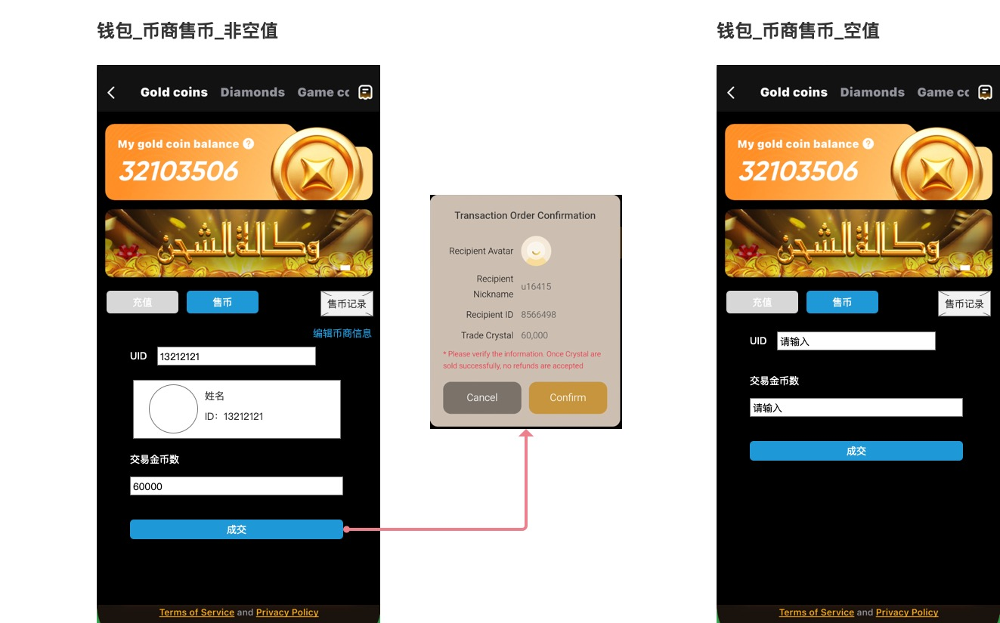

#### 前置条件
- 当前登录用户已开通币商身份；未开通时不展示币商钱包入口。
- 当前币商交易状态为可交易状态。
- 当前币商余额充足，且本次出售金额在允许范围内。
- 当前页面默认由钱包中的币商页签进入。

#### 页面字段定义

| 区块位置 | 字段名称 | 定义 | 统计/计算口径 | 数据来源 |
|---|---|---|---|---|
| 顶部标题区 | Gold coins / Diamonds / Game cc 页签 | 钱包资产页签入口 | Gold coins 当前高亮；其他页签为切换入口 | 页面状态 + 钱包资产页签配置 |
| 余额卡 | My gold coin balance | 当前币商金币余额标题 | 固定文案 | 页面文案 |
| 余额卡 | 金币余额值 | 当前币商可用于售卖的金币余额展示 | 读取币商详情中的 `coin + sendCoin` | 币商详情接口 |
| 余额卡 | 帮助图标 | 查看币商余额说明入口 | 点击打开说明层或帮助页 | 页面交互 |
| 活动区 | Banner | 币商活动或品牌宣传位 | 按活动配置返回 | Web 页/运营配置 |
| 操作切换区 | 充值 | 币商给自己补充金币的入口 | 点击切换到币商充值页 | 页面交互 |
| 操作切换区 | 售币 | 当前高亮页签 | 当前页固定高亮 | 页面交互 |
| 操作切换区 | 售币记录 | 币商历史交易记录入口 | 点击跳转交易记录页 | 页面交互 |
| 辅助操作区 | 编辑币商信息 | 维护币商对外展示信息的入口 | 点击跳转编辑币商信息页 | 页面交互 |
| 表单区 | UID | 本次购买方的用户编号 | 仅允许输入数字；长度上限 10 位 | 用户输入 |
| 表单区 | 购买方昵称/头像/ID卡片 | 输入 UID 后带出的购买方信息 | 根据 UID 实时查询；查不到则提示不存在 | 用户搜索接口 / 用户信息接口 |
| 表单区 | 交易金币数 | 本次出售金币数量 | 仅允许纯数字；最小 5000，最大 9000000 | 用户输入 |
| 底部主按钮 | 成交 | 发起本次售币交易 | UID、交易金币数合法后方可提交 | 页面交互 |
| 底部协议区 | Terms of Service / Privacy Policy | 协议入口 | 固定文案 | 页面文案 |

#### 统计/计算口径

| 项目 | 口径 |
|---|---|
| 币商余额展示 | 当前币商 `coin + sendCoin` 的合计值 |
| 单笔最小出售金额 | 5000 金币 |
| 单笔最大出售金额 | 9000000 金币 |
| 实际售卖扣减余额 | 优先扣减赠送金币余额 `sendCoin`，不足部分再扣普通金币余额 `coin` |
| 页面价格换算说明 | 服务端记账时会按固定倍率把金币换算成订单价格，用于交易记录和月度统计；页面默认以金币数量为主展示 |
| 购买方识别 | 依据 UID 查询用户信息，查到后展示购买方卡片 |
| 售币成功联动 | 售币成功后必须同步刷新币商余额，并在售币记录页产生对应记录 |

#### 交互逻辑

1. 币商进入售币页时，页面先拉取币商详情，展示当前金币余额和交易状态。
2. 页面默认进入空值态：
   - UID 输入框展示占位文案 `请输入`；
   - 交易金币数输入框展示占位文案 `请输入`；
   - 不展示购买方信息卡片。
3. 用户输入 UID 后：
   - 输入框只允许数字字符，最多 10 位；
   - 页面实时查询该 UID 对应用户；
   - 若 UID 不存在，立即 Toast：`UID不存在`；
   - 查询成功后，展示购买方头像、昵称、ID 卡片。
4. 用户输入交易金币数：
   - 仅允许纯数字；
   - 低于 5000 时，视为不满足最小出售金额；
   - 高于 9000000 时，视为超出单笔上限。
5. 成交按钮置灰规则：
   - UID 未填写时不可点击；
   - UID 未识别到有效购买方时不可点击；
   - 交易金币数未填写或不合法时不可点击；
   - 当前币商余额不足时不可提交。
6. 所有条件满足后，成交按钮高亮。
7. 用户点击成交后，系统先执行前置校验：
   - 币商当前是否允许交易；
   - UID 是否存在；
   - 金额是否在 5000~9000000 范围内；
   - 当前可卖余额是否足够；
   - 购买方是否为审核用户/异常用户；
   - 是否命中其他交易限制。
8. 若校验通过，弹出“Transaction Order Confirmation”交易订单确认弹窗。
9. 用户点击弹窗 `Cancel` 时，关闭弹窗并保留页面输入内容。
10. 用户点击弹窗 `Confirm` 后，提交正式售币请求。
11. 提交成功后：
   - 卖方币商余额扣减；
   - 购买方收到对应金币；
   - 币商交易明细写入；
   - 售币记录页可查询到本次记录。

#### 交易订单确认弹窗

| 区块位置 | 字段名称 | 定义 | 展示/校验规则 |
|---|---|---|---|
| 弹窗标题 | Transaction Order Confirmation | 交易订单确认标题 | 固定文案 |
| 收款人信息区 | Recipient Avatar | 购买方头像 | 与 UID 查询结果一致 |
| 收款人信息区 | Recipient / Nickname | 购买方昵称 | 与 UID 查询结果一致 |
| 收款人信息区 | Recipient ID | 购买方 ID | 与 UID 查询结果一致 |
| 交易信息区 | Trade Coins / 交易金币数 | 本次出售金币数量 | 与表单输入金额一致；不得在弹窗中被二次修改 |
| 风险提示区 | 不可退款提示 | 提醒用户确认后不可撤回 | 红色提示文案展示 |
| 操作区 | Cancel | 取消本次确认 | 关闭弹窗，保留输入 |
| 操作区 | Confirm | 确认提交售币 | 提交正式售币请求 |

#### 状态定义

| 状态 | 触发条件 | 页面表现 |
|---|---|---|
| 默认空表单态 | 首次进入售币页 | 展示余额、UID空输入框、交易金币数空输入框 |
| UID识别成功态 | UID 查询到有效用户 | 展示购买方头像、昵称、ID 信息卡 |
| UID不存在态 | UID 查询失败 | Toast：`UID不存在`，不展示用户卡片 |
| 金额非法态 | 输入非数字、低于最小值、超过最大值 | 按钮不可点击；点击成交时提示异常原因 |
| 可提交态 | UID、购买方信息、金额均合法，且余额充足 | 成交按钮高亮 |
| 交易确认态 | 用户点击成交且预校验通过 | 弹出交易订单确认弹窗 |
| 提交成功态 | 用户确认后服务端记账成功 | 返回成功结果，余额和记录刷新 |
| 提交失败态 | 服务端校验失败或交易失败 | Toast 提示失败原因，页面保留输入内容 |

#### 系统后台核心逻辑

- 币商售币入口由币商能力开关控制；客户端只有在用户扩展信息中存在币商入口时才展示币商页签，当前页签内容由 WebView 承接。
- 页面进入时，系统会先查询币商详情，返回当前币商余额、冻结余额、是否可充值、是否可交易等状态。
- 服务端售币主链路先校验当前币商是否存在、交易状态是否正常，以及该币商是否被禁止交易；若不满足，则直接拦截。
- 服务端会根据输入 UID 解析购买方用户身份，并把购买方用户ID写入正式交易请求。
- 单笔售币金额由服务端强校验：最低 5000，最高 9000000。
- 正式扣减时，服务端会优先消耗币商赠送金币余额，不足部分再扣减普通金币余额，并同步生成充值记录与币商交易明细。
- 每笔售币成功后都会写入币商交易明细，明细中保留：交易金币、赠送金币、交易来源类型、交易类型、购买方用户信息、账户类型、创建时间等字段。

#### 补充业务说明（结合原需求文档）

1. UID、交易金币数均为必填项，只有全部校验通过后才允许成交。
2. UID 输入框限制 10 个数字字符，输入后即查购买方；若不存在立即 Toast：`UID不存在`。
3. 交易金币数只允许纯数字，最小 5000，最大 9000000。
4. 成交前必须校验：
   - 购买方异常（封号、冻结、审核用户等）→ `购买方异常，出售失败`；
   - 超出最大值 → `已超最大卖出限制，出售失败`；
   - 低于最小值 → `低于最少卖出限制，出售失败`；
   - 自己卖自己 → `无法自己卖出给自己，出售失败`；
   - 输入金额大于余额 → `账户可卖出余额不足，出售失败`；
   - 购买方是审核用户 → `购买方异常，出售失败`。
5. 交易确认弹窗必须展示购买方身份和交易金币数，避免币商误把金币卖给错误用户。

#### 异常与测试关注点

- UID 非数字、超长、为空时，按钮和查询行为是否正确。
- UID 不存在时，是否立即 Toast `UID不存在`，且不残留上一次查询结果。
- 金额 4999 / 5000 / 9000000 / 9000001 四个边界值必须分别验证。
- 币商余额不足时，是否提示 `账户可卖出余额不足，出售失败`。
- 购买方为审核用户、异常用户、被限制用户时，是否统一提示 `购买方异常，出售失败`。
- 成交弹窗中的购买方头像、昵称、ID、交易金币数是否与表单识别结果一致。
- 用户点击 Cancel 后，弹窗关闭且页面输入内容不丢失。
- 用户点击 Confirm 后，才允许正式提交售币请求。
- 售币成功后，币商余额、购买方到账、交易记录三处数据必须同时一致。

### 6.1.13 币商售币-交易记录页

#### 页面定位
用于展示币商历史售币交易流水，帮助币商回看最近交易对象、交易时间、交易金币数及记录状态。

#### 对应原型
`/Users/mac/心音跳动/TOPKHLIJ/钱包模块/原型图/币商售币-交易记录.jpg`

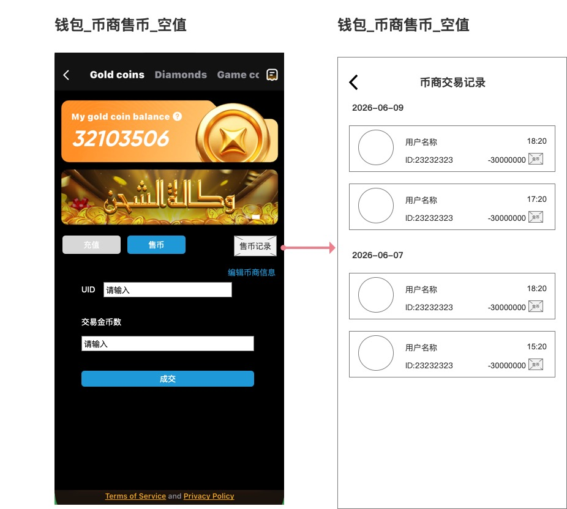

#### 前置条件
- 当前登录用户已开通币商身份。
- 当前币商页签可正常访问。
- 币商交易明细接口可返回分页数据。

#### 页面字段定义

| 区块位置 | 字段名称 | 定义 | 统计/计算口径 | 数据来源 |
|---|---|---|---|---|
| 顶部导航 | 返回按钮 | 返回上一页售币页 | 点击后返回 | 页面交互 |
| 顶部导航 | 币商交易记录 | 当前页面标题 | 固定标题 | 页面文案 |
| 日期分组区 | 日期标题 | 交易记录按自然日分组展示 | 交易时间格式化为 `YYYY-MM-DD` | 交易记录接口 + 页面格式化 |
| 记录卡片 | 用户头像 | 交易对象头像 | 读取购买方/关联用户信息；无头像时展示默认头像 | 交易记录接口 |
| 记录卡片 | 用户昵称 | 交易对象昵称 | 直接展示；无昵称时按默认昵称兜底 | 交易记录接口 |
| 记录卡片 | 用户ID | 交易对象 ID | 以 `ID:xxx` 格式展示 | 交易记录接口 |
| 记录卡片 | 交易时间 | 当前记录发生时间 | 交易时间格式化为 `HH:mm` | 交易记录接口 |
| 记录卡片 | 金币变动值 | 当前记录交易金币数 | 售币记录展示为负数，表示币商金币减少 | 交易记录接口 |
| 记录卡片 | 查看/详情按钮 | 查看该笔记录详情或详情入口 | 原型文案较小，最终文案以设计稿确认为准 | 页面交互 |

#### 统计/计算口径

| 项目 | 口径 |
|---|---|
| 记录排序 | 默认按创建时间倒序展示 |
| 日期分组 | 按自然日分组展示，同一日期下展示该日全部交易记录 |
| 同日排序 | 同一日期内按交易时间倒序展示 |
| 金额方向 | 售币记录展示为负数，表示币商余额减少 |
| 金额展示格式 | 优先使用千分位或完整数字格式，需保证大额金币可读性 |
| 筛选能力 | 当前原型未展示主动筛选控件；如接入服务端筛选能力，应另行补充筛选入口与空态规则 |

#### 交互逻辑

1. 用户在币商售币页点击 `售币记录` 进入交易记录页。
2. 页面默认请求交易记录列表，并按时间倒序返回。
3. 列表按日期分组展示，每条记录显示交易对象头像、昵称、ID、交易时间、金币变动值。
4. 用户点击顶部返回按钮时，返回币商售币页。
6. 页面支持下拉刷新 / 上拉分页（具体交互方式按最终承接页面实现）。
7. 若列表为空，则展示空态。

#### 状态定义

| 状态 | 触发条件 | 页面表现 |
|---|---|---|
| 首次加载态 | 首次进入记录页 | 列表 loading |
| 非空态 | 返回至少 1 条记录 | 按日期分组展示记录 |
| 空态 | 返回 0 条记录 | 展示空状态 |
| 分页加载态 | 用户上拉到底部 | 加载下一页 |
| 分页到底态 | 无更多记录 | 停止加载，展示到底提示或保持列表底部 |
| 头像缺省态 | 交易对象无头像 | 展示默认头像 |

#### 系统后台核心逻辑

- 币商交易记录页的数据来源于币商交易明细，系统会为每次售币成功写入一条独立记录。
- 每条记录至少保留：交易金币、赠送金币、交易来源类型、交易类型、关联用户、账户类型、备注、创建时间、操作后余额。
- 售币页成交成功后，必须能在交易记录页查询到对应流水，避免余额扣减和记录展示断链。
- 交易记录中的用户头像、昵称、用户ID等展示信息，会在返回记录时补充关联用户基础信息，供页面直接展示。
- 当前原型未展示日期筛选、UID 搜索、状态筛选等控件；如后续版本需要筛选能力，应补充筛选入口、筛选条件、筛选空态和重置规则。

#### 异常与测试关注点

- 售币成功后，新流水是否能进入交易记录页。
- 卖出记录是否正确展示为负数金额。
- 日期分组和时间排序是否正确。
- 交易对象不存在头像/昵称时，页面是否有兜底展示。
- 空列表时是否展示空态，而不是白屏。
- 上拉分页是否会重复加载同一批记录。
- 返回售币页后，售币页余额是否与最新交易记录保持一致。

### 6.1.14 币商充值列表页

#### 页面定位
用于承接“通过币商充值金币”的列表页场景。该页面不是标准 IAP 充值，也不是第三方支付直接收银台，而是先让用户在币商列表中筛选并联系合适的币商，再继续后续币商充值路径。

从代码现状看：
- 客户端钱包中的币商入口当前由 WebView 承接；
- 币商入口仅对满足门槛的用户展示；
- 原型图表达的是币商充值列表页的目标业务结构与交互规则。

#### 对应原型
`/Users/mac/心音跳动/TOPKHLIJ/钱包模块/原型图/币商充值金币.jpg`

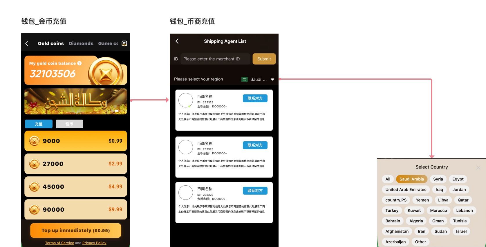

#### 前置条件
- 用户已登录
- 用户财富等级大于等于 10 级，才展示币商充值金币入口
- 当前存在至少 1 位可展示的有效币商

#### 页面字段定义

| 区块位置 | 字段名称 | 定义 | 统计/计算口径 | 数据来源 |
|---|---|---|---|---|
| 入口区 | 币商充值金币入口 | 从金币充值页进入币商充值列表页的入口 | 仅对财富等级 ≥ 10 级用户展示 | 客户端用户财富等级 + 币商入口配置 |
| 顶部标题区 | Shipping Agent List | 币商充值列表页标题 | 固定标题 | 页面文案 |
| 搜索区 | ID 输入框 | 按币商 ID 或靓号搜索指定币商 | 输入后点击 Submit 触发查询；支持真实用户ID与靓号搜索 | 用户输入 |
| 搜索区 | Submit | 提交币商 ID 查询 | 刷新列表 | 页面交互 |
| 区域筛选区 | Please select your region | 当前筛选国家/地区入口 | 点击后弹出国家选择弹窗 | 页面交互 |
| 区域筛选区 | 当前选中国家 | 当前列表筛选中的国家/地区 | 选中后回显 | 页面交互 |
| 列表卡片 | 币商头像 | 币商头像 | 直接展示 | 币商列表接口 |
| 列表卡片 | 在线绿点 | 币商在线状态提示 | 若币商在线则显示绿点，否则不显示 | 币商列表接口在线状态 |
| 列表卡片 | 币商昵称 | 币商昵称 | 直接展示 | 币商列表接口 |
| 列表卡片 | 币商ID | 币商用户编号 | 直接展示 | 币商列表接口 |
| 列表卡片 | 金币余额 | 币商当前金币余额展示值 | 大于 1000000 时统一展示为 `1000000+` | 币商列表接口 |
| 列表卡片 | 币商信息 | 币商自己设置的展示信息 | 若为空则不展示该区块 | 币商列表接口 |
| 列表卡片 | 联系对方 | 币商联系方式入口 | 点击展示联系方式或跳转联系弹层 | 币商列表接口 |
| 列表卡片 | 支持国家 | 币商支持展示的国家列表 | 可用于列表筛选命中 | 币商后台配置 |

#### 统计/计算口径

| 项目 | 口径 |
|---|---|
| 入口可见性 | 用户财富等级 ≥ 10 级时展示币商充值金币入口 |
| 默认列表准入规则 | 默认仅展示金币余额大于等于 1000000 的有效币商 |
| ID 搜索豁免规则 | 用户输入币商 ID 或靓号并命中指定币商时，即使该币商金币余额小于 1000000，也允许展示该币商 |
| 币商余额展示 | 币商金币余额 > 1000000 时统一展示为 `1000000+`，否则展示真实余额 |
| 币商信息展示 | 币商信息为空时不展示该信息区块 |
| 在线状态展示 | 在线则头像处显示绿点，不在线则不显示 |
| 国家筛选命中 | 仅展示支持当前国家/地区的币商 |
| 列表排序主规则 | 按当月售出金币数量降序排序 |
| 列表排序并列规则 | 当月售出金币数量相同时，先达到该当月输出金币数的币商排在前面 |

#### 交互逻辑

1. 用户在金币充值页点击币商充值金币入口。
2. 系统先校验用户财富等级：
   - 财富等级 < 10：不展示入口；
   - 财富等级 ≥ 10：允许进入币商充值列表页。
3. 页面默认加载币商列表时，仅展示金币余额大于等于 1000000 的有效币商。
4. 默认列表按当月售出金币数量降序排序；若当月售出金币数量相同，则先达到该当月输出金币数的币商排在前面。
5. 用户可通过两种方式筛选币商：
   - 输入币商 ID 或靓号后点击 Submit；
   - 点击国家/地区选择器后，从国家弹窗中选择目标国家。
6. 当用户通过币商 ID 或靓号精确命中指定币商时：
   - 该币商即使金币余额小于 1000000，也允许进入结果列表；
   - 若同时选择了国家/地区，则该币商仍需满足当前国家筛选条件才展示。
7. 币商卡片仅展示以下信息：
   - 币商头像
   - 币商昵称
   - 币商 ID
   - 金币余额（大于 1000000 显示 `1000000+`）
   - 币商自己设置的币商信息（为空则不展示）
   - 联系对方按钮
8. 若币商在线，则在头像处展示绿点；若不在线，则不展示绿点。
9. 用户点击 `联系对方` 后，展示该币商配置的联系方式。
10. 用户点击 `编辑币商信息` 入口时，跳转到编辑币商信息页面。

#### 状态定义

| 状态 | 触发条件 | 页面表现 |
|---|---|---|
| 入口隐藏态 | 用户财富等级 < 10 | 金币充值页不展示币商充值金币入口 |
| 入口可见态 | 用户财富等级 ≥ 10 | 金币充值页展示币商充值金币入口 |
| 列表默认态 | 进入币商充值列表页 | 默认展示金币余额大于等于 1000000 的有效币商，并按既定排序规则返回 |
| 国家筛选态 | 用户选择国家/地区 | 仅展示该国家支持的币商 |
| ID 搜索态 | 用户输入币商 ID 或靓号并提交 | 定位指定币商；命中时可突破默认余额门槛展示 |
| 空态 | 当前筛选条件下无币商 | 展示空状态 |

#### 系统后台核心逻辑

- 币商充值金币入口受财富等级门槛控制，当前规则为：仅对财富等级大于等于 10 级用户展示。
- 币商列表默认结果集只包含有效状态且金币余额大于等于 1000000 的币商。
- 币商列表中的 ID 搜索必须同时支持真实用户 ID 与靓号精确检索。
- 当用户通过 ID 或靓号精确命中指定币商时，该币商可突破默认余额门槛进入结果集，但仍需满足状态有效和国家筛选条件。
- 币商列表默认按当月售出金币数量降序排序；若数值并列，则按“先达到该当月输出金币数的时间”升序排序。
- 币商列表页返回数据时，仅需返回前端真实展示所需字段：头像、昵称、ID、余额、在线状态、币商信息、联系方式、支持国家。
- 币商余额展示存在前端展示上限规则：大于 1000000 统一显示为 `1000000+`。
- 币商信息属于币商自己维护的展示信息；若未配置，则前端不展示该信息区块。
- 国家筛选仅影响可见币商列表，不直接影响币商余额或联系方式口径。

#### 异常与测试关注点

- 财富等级 < 10 时，币商充值金币入口必须不可见
- 财富等级 ≥ 10 时，币商充值金币入口必须可见
- 默认列表中，金币余额为 999999 的币商不应展示
- 通过币商 ID 或靓号精确搜索金币余额为 999999 的币商时，应允许展示该币商
- 币商余额为 1000001 时应展示 `1000000+`
- 币商余额为 1000000 时应展示真实值 `1000000`
- 币商信息为空时，该信息区块不展示
- 在线币商头像需展示绿点，离线币商头像不展示绿点
- 国家筛选弹窗选择后，列表需按国家正确刷新
- 币商 ID / 靓号搜索和国家筛选同时生效时，列表结果需正确收敛
- 当月售出金币数量排序与并列时序排序需正确生效

### 6.1.15 编辑币商信息页

#### 页面定位
用于让币商编辑自己在币商列表中的展示信息。该信息为自由文本说明，用于在币商充值列表卡片中向用户展示。

#### 对应原型
`/Users/mac/心音跳动/TOPKHLIJ/钱包模块/原型图/编辑币商信息.jpg`

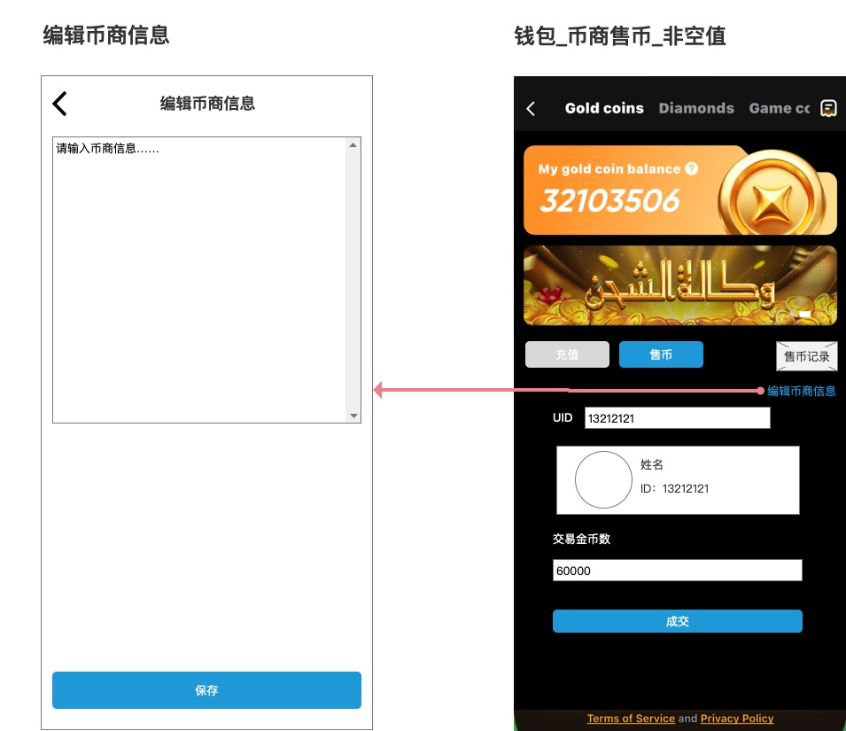

#### 前置条件
- 当前用户已具备币商身份
- 当前用户从币商充值列表页点击 `编辑币商信息` 入口进入

#### 页面字段定义

| 区块位置 | 字段名称 | 定义 | 统计/计算口径 | 数据来源 |
|---|---|---|---|---|
| 顶部标题 | 编辑币商信息 | 页面标题 | 固定标题 | 页面文案 |
| 文本输入区 | 币商信息输入框 | 币商自己设置的对外展示信息 | 最多输入 300 字 | 用户输入 |
| 底部按钮 | 保存 | 保存当前币商信息 | 提交前需校验内容不超过 300 字 | 页面交互 |

#### 交互逻辑

1. 用户在币商充值列表页点击 `编辑币商信息`。
2. 页面跳转到编辑币商信息页。
3. 用户在大文本框中输入或修改币商信息，最大长度为 300 字。
4. 当输入达到 300 字时，前端不再允许继续输入；用户仍可删除已有内容后继续编辑。
5. 点击 `保存` 后，系统校验内容长度不超过 300 字，再保存该币商信息。
6. 保存成功后，返回币商充值列表页，并在币商卡片中展示最新信息。
7. 若保存为空，则币商列表卡片中不展示该信息区块。

#### 状态定义

| 状态 | 触发条件 | 页面表现 |
|---|---|---|
| 初始编辑态 | 首次进入页面 | 展示当前币商信息内容 |
| 编辑中态 | 用户输入文本 | 文本框内容变化 |
| 输入上限态 | 用户输入达到 300 字 | 不再允许继续输入，仅允许删除或直接保存 |
| 保存成功态 | 点击保存并保存成功 | 返回上一页并刷新币商信息 |
| 空信息态 | 保存为空 | 币商列表页不展示币商信息区块 |

#### 系统后台核心逻辑

- 币商信息属于币商自己的展示资料，不属于交易规则字段。
- 币商信息字段长度上限为 300 字，客户端与服务端都需按同一上限校验。
- 保存后，该字段仅用于币商列表展示，不参与售币价格、币商余额、国家筛选等核心计算。
- 若当前币商信息为空，前端币商卡片不应占位展示空文案。

#### 异常与测试关注点

- 输入 300 字时应允许保存
- 输入第 301 个字时应被拦截，不允许继续输入
- 保存成功后，返回列表页是否能立即看到更新结果
- 保存为空后，列表卡片的信息区块是否正确消失
- 长文本输入时，列表卡片展示是否能正确换行/裁剪

### 6.1.16 后台币商管理

#### 页面定位
用于在后台新增币商、维护币商支持国家、查看已添加的币商以及注销币商身份。

#### 对应原型
`/Users/mac/心音跳动/TOPKHLIJ/钱包模块/原型图/后台-币商管理.jpg`

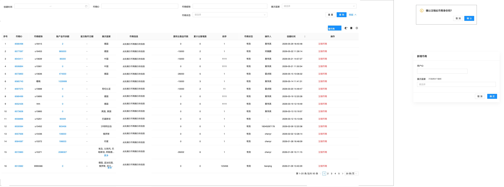

#### 前置条件
- 当前操作者具备后台币商管理权限

#### 页面字段定义

| 区块位置 | 字段名称 | 定义 | 统计/计算口径 | 数据来源 |
|---|---|---|---|---|
| 筛选区 | 创建时间 | 按创建时间范围筛选币商 | 起止时间组合查询 | 用户输入 |
| 筛选区 | 币商ID | 按币商ID或靓号筛选 | 支持真实用户ID与靓号精确搜索 | 用户输入 |
| 筛选区 | 币商昵称 | 按币商昵称筛选 | 关键词模糊搜索 | 用户输入 |
| 筛选区 | 展示国家 | 按展示国家筛选 | 下拉筛选 | 后台配置 |
| 筛选区 | 币商状态 | 按状态筛选 | 下拉筛选 | 后台配置 |
| 筛选区 | 重置 | 清空当前筛选条件 | 恢复默认列表并回到第一页 | 页面交互 |
| 筛选区 | 查询 | 按当前条件执行查询 | 刷新列表 | 页面交互 |
| 筛选区 | 收起 | 收起筛选区域 | 仅收起筛选区，不清空已选条件 | 页面交互 |
| 列表区 | 币商ID | 币商唯一标识 | 直接展示 | 币商数据 |
| 列表区 | 币商昵称 | 币商昵称 | 直接展示 | 币商数据 |
| 列表区 | 账户金币余额 | 当前币商金币余额 | 直接展示 | 币商数据 |
| 列表区 | 首次购币日期 | 首次发生币商购币行为的日期 | 直接展示 | 币商数据 |
| 列表区 | 展示国家 | 当前币商支持展示的国家 | 多国家展示，超长可用“更多”收口 | 币商配置 |
| 列表区 | 币商信息 | 币商自己设置的展示信息 | 直接展示 | 币商配置 |
| 列表区 | 累计出售金币数 | 历史累计出售金币数 | 直接展示 | 币商交易统计 |
| 列表区 | 累计出售笔数 | 历史累计出售订单数 | 直接展示 | 币商交易统计 |
| 列表区 | 排序 | 币商排序值 | 直接展示 | 后台配置 |
| 列表区 | 币商状态 | 当前状态，如有效 | 直接展示 | 币商数据 |
| 列表区 | 操作人 | 最近操作人 | 直接展示 | 操作日志 |
| 列表区 | 创建时间 | 币商创建时间 | 直接展示 | 币商数据 |
| 列表区 | 创建时间排序 | 按创建时间切换升序/降序 | 点击表头切换排序方向 | 页面交互 |
| 列表区 | 操作 | 注销币商 | 点击弹二次确认框 | 后台交互 |
| 新增弹窗 | 用户ID | 输入要新增为币商的用户 ID | 直接提交 | 用户输入 |
| 新增弹窗 | 展示国家 | 为该币商配置支持的国家 | 可选至少 5 个国家 | 用户输入 |
| 新增弹窗 | 确定 | 确认新增币商 | 提交新增动作 | 页面交互 |
| 注销弹窗 | 确认注销此币商身份吗？ | 注销确认文案 | 固定文案 | 页面文案 |
| 注销弹窗 | 取消/确认 | 取消或确认注销 | 二次确认 | 页面交互 |

#### 交互逻辑

1. 后台进入币商管理页后，默认加载筛选区和币商列表。
2. 用户可在筛选区填写或选择以下条件：
   - 创建时间范围
   - 币商ID或靓号
   - 币商昵称
   - 展示国家
   - 币商状态
3. 各筛选条件组合时按“且”的关系生效。
4. 用户点击 `查询` 后：
   - 按当前全部筛选条件刷新列表；
   - 分页回到第一页；
   - 保留当前筛选值。
5. 用户点击 `重置` 后：
   - 清空当前筛选区全部条件；
   - 恢复默认列表结果；
   - 分页回到第一页。
6. 用户点击 `收起` 后：
   - 仅收起筛选区域；
   - 不清空已输入筛选条件；
   - 当前查询结果保持不变。
7. 用户点击列表中的 `创建时间` 表头排序控件时，可在升序和降序之间切换；切换后仅影响当前筛选结果集的展示顺序。
8. 点击 `新增币商` 后，打开新增币商弹窗。
9. 在新增弹窗中输入：
   - 用户ID
   - 展示国家（支持配置至少 5 个国家）
10. 点击 `确定` 后，新增币商并回到列表页展示。
11. 后台列表页需展示已添加的币商。
12. 点击 `注销币商` 后，弹出确认框：`确认注销此币商身份吗？`
13. 点击确认后，注销该币商身份；点击取消则关闭确认框。

#### 状态定义

| 状态 | 触发条件 | 页面表现 |
|---|---|---|
| 列表展示态 | 进入后台页面 | 展示币商列表 |
| 筛选编辑态 | 用户输入或选择筛选条件 | 筛选区内容变化，但列表暂不刷新 |
| 筛选结果态 | 用户点击查询 | 刷新筛选结果并回到第一页 |
| 筛选收起态 | 用户点击收起 | 筛选区折叠，当前条件与结果保留 |
| 新增弹窗态 | 点击新增币商 | 展示新增弹窗 |
| 新增成功态 | 新增提交成功 | 列表新增对应币商 |
| 注销确认态 | 点击注销币商 | 展示确认框 |
| 注销成功态 | 确认注销成功 | 列表中该币商状态更新或消失 |

#### 系统后台核心逻辑

- 后台所有基于 ID 的搜索输入框，均需同时支持真实用户 ID 与靓号检索。
- 后台筛选条件按“且”的关系组合执行，查询结果只返回同时满足当前全部条件的币商。
- 点击 `查询` 或 `重置` 后，列表分页都必须回到第一页。
- `收起` 仅控制筛选区展示状态，不改变当前筛选条件和当前结果集。
- 创建时间筛选用于控制结果范围；创建时间表头排序用于控制当前结果集展示顺序，两者可以同时生效。
- 后台可通过用户 ID 新增币商，并同时配置该币商支持的国家。
- 币商管理页必须展示已添加的币商。
- 币商支持国家配置既用于后台展示，也用于前台币商充值列表按国家过滤。
- 后台可注销币商身份；注销后，前台币商充值列表不再展示该币商。

#### 异常与测试关注点

- 币商ID输入真实用户ID与靓号时，查询结果都必须正确命中
- 创建时间、币商ID/靓号、昵称、展示国家、币商状态组合筛选时，列表结果是否正确
- 点击查询后，列表是否刷新且分页是否回到第一页
- 点击重置后，筛选条件是否清空且默认列表是否恢复
- 点击收起后，筛选条件和列表结果是否仍然保留
- 点击创建时间排序后，当前结果集顺序是否正确切换
- 新增币商后，列表是否能立即展示新增结果
- 多国家配置后，列表“展示国家”是否正确展示并支持“更多”收口
- 注销币商后，前台币商充值列表是否同步失效

## 6.2 金币明细页

### 6.2.1 页面定位
用于展示金币账户历史流水，帮助用户追踪金币收入、支出、发生时间和每笔后的余额。

### 6.2.2 对应原型
`/Users/mac/心音跳动/TOPKHLIJ/钱包模块/原型图/金币明细.jpg`

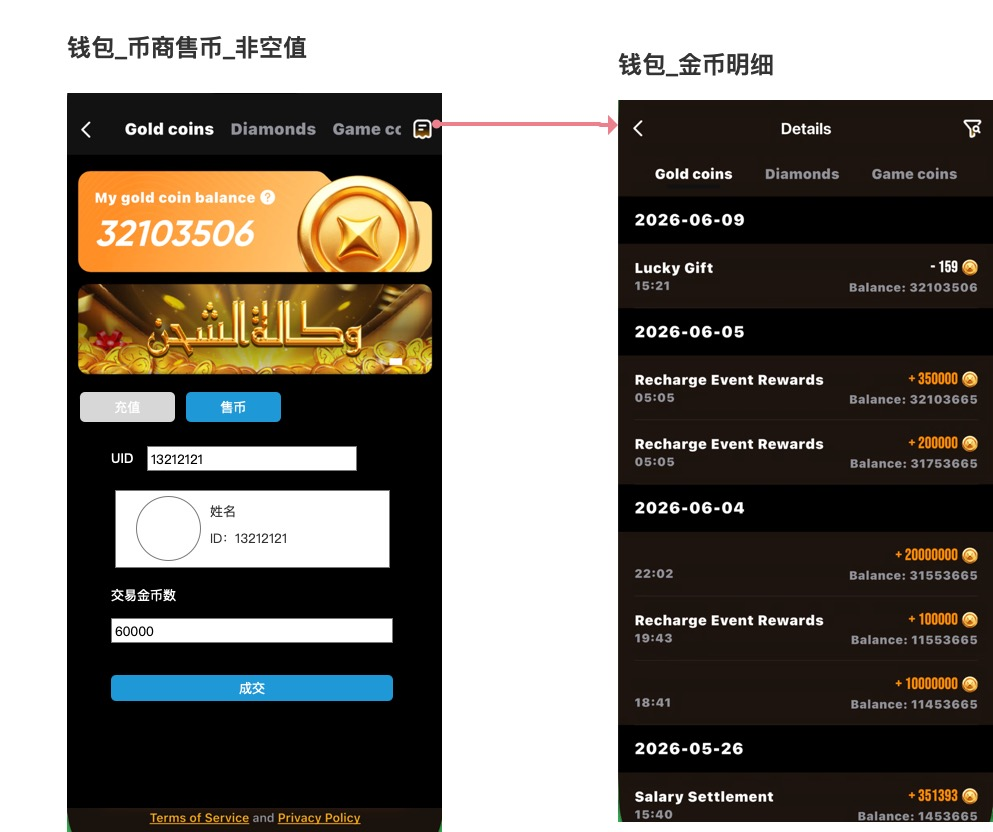

### 6.2.3 前置条件
- 用户已登录
- 钱包支持展示 `Gold coins` 明细页签

### 6.2.4 页面字段定义

| 区块位置 | 字段名称 | 定义 | 统计/计算口径 | 数据来源 |
|---|---|---|---|---|
| 顶部标题 | Details | 明细页标题 | 固定文案 | 客户端多语言 |
| 顶部 Tab | Gold coins | 当前选中明细页签 | 当前页签高亮 | 客户端动态 Tab |
| 顶部 Tab | Diamonds | 可切换页签 | 固定页签 | 客户端动态 Tab |
| 顶部 Tab | Game coins | 可切换页签 | 固定页签 | 客户端动态 Tab |
| 右上角 | 筛选按钮 | 打开金币明细筛选器 | 点击弹出筛选弹层 | 客户端交互 |
| 日期分组 | 日期标题 | 按日期分组的标题 | `createTime -> YYYY-MM-DD` | 客户端本地格式化 |
| 列表项左主信息 | typeName | 流水来源名称 | 直接展示 | 服务端明细接口 |
| 列表项左次信息 | 时间 | 当前流水发生时间 | `createTime -> HH:mm` | 客户端本地格式化 |
| 列表项右主信息 | 变动金额 | 本次金币变动值 | 正值加 `+`，负值加 `-` | 服务端明细接口 |
| 列表项右主信息 | 金币图标 | 当前明细资产图标 | 固定金币 icon | 客户端静态资源 |
| 列表项右次信息 | Balance | 本次流水后的金币余额 | 直接展示 `balance` | 服务端明细接口 |

### 6.2.5 统计/计算口径

| 项目 | 口径 |
|---|---|
| 日期分组 | 按自然日倒序分组 |
| 时间展示 | 仅展示 `HH:mm` |
| 金额符号 | `coin > 0` 显示 `+`；否则显示 `-` |
| 余额 | 直接展示该笔交易后的金币余额 |

### 6.2.6 交互逻辑

1. 用户进入 `Gold coins` 明细页。
2. 页面请求金币明细接口。
3. 列表按日期分组展示。
4. 用户点击筛选按钮后，弹出金币类型筛选器。
5. 用户选择筛选项后：
   - 重置分页
   - 刷新当前列表
6. 页面支持：
   - 下拉刷新
   - 上拉加载更多
7. 用户切换至其他资产页签时，切换显示对应币种明细。

### 6.2.7 状态定义

| 状态 | 触发条件 | 页面表现 |
|---|---|---|
| 加载中 | 首次进入页面 | 列表 loading |
| 非空态 | 返回至少 1 条记录 | 按日期分组展示流水 |
| 空态 | 返回 0 条记录 | 展示空状态 |
| 筛选切换态 | 用户切换筛选项 | 重置并刷新列表 |
| 分页加载态 | 用户上拉到底部 | 加载下一页 |

### 6.2.8 系统后台核心逻辑

- 系统会按金币资产流水向客户端提供分页明细数据，并支持按交易来源类型进行筛选。
- 每条金币明细至少会返回：交易来源名称、变动金额、变动时间、对应图标以及该笔交易后的余额。
- 金币明细的数据口径覆盖用户在金币账户上的主要账变来源，包括充值、礼物、游戏、平台奖励、兑换、装扮消耗、房间相关消耗、红包以及充值奖励等。
- 当用户切换筛选条件时，系统会基于新的筛选范围重新返回当前条件下的金币流水结果。

### 6.2.9 异常与测试关注点

- 日期分组切换是否正确
- 负向金额是否展示 `-`
- 余额是否与流水顺序一致
- 筛选后分页是否从第一页重新加载
- 原型未展示筛选弹层内容，本需求按客户端真实筛选能力定义

---

## 6.3 钻石明细页

### 6.3.1 页面定位
用于展示钻石账户历史流水，帮助用户追踪钻石增加、消耗及每笔后的余额变化。

### 6.3.2 对应原型
`/Users/mac/心音跳动/TOPKHLIJ/钱包模块/原型图/钻石明细.jpg`

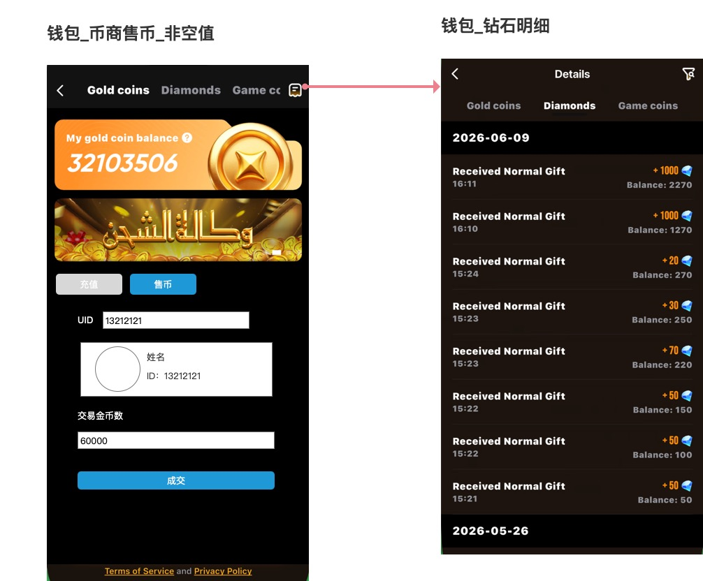

### 6.3.3 前置条件
- 用户已登录
- 钱包支持展示 `Diamonds` 明细页签

### 6.3.4 页面字段定义

| 区块位置 | 字段名称 | 定义 | 统计/计算口径 | 数据来源 |
|---|---|---|---|---|
| 顶部标题 | Details | 明细页标题 | 固定文案 | 客户端多语言 |
| 顶部 Tab | Diamonds | 当前选中页签 | 当前页签高亮 | 客户端动态 Tab |
| 右上角 | 筛选按钮 | 打开钻石明细筛选器 | 点击弹出筛选弹层 | 客户端交互 |
| 日期分组 | 日期标题 | 按日期分组的标题 | `createTime -> YYYY-MM-DD` | 客户端格式化 |
| 列表项左主信息 | typeName | 钻石流水来源名称 | 直接展示 | 服务端明细接口 |
| 列表项左次信息 | 时间 | 流水发生时间 | `createTime -> HH:mm` | 客户端格式化 |
| 列表项右主信息 | 变动金额 | 本次钻石变动值 | 正值加 `+`，负值加 `-` | 服务端明细接口 |
| 列表项右主信息 | 钻石图标 | 当前明细资产图标 | 固定钻石 icon | 客户端静态资源 |
| 列表项右次信息 | Balance | 本次流水后的钻石余额 | 直接展示 `balance` | 服务端明细接口 |

### 6.3.5 统计/计算口径

| 项目 | 口径 |
|---|---|
| 日期分组 | 按自然日倒序分组 |
| 时间展示 | 仅展示 `HH:mm` |
| 金额符号 | `coin > 0` 显示 `+`；否则显示 `-` |
| 余额 | 直接展示该笔交易后的钻石余额 |

### 6.3.6 交互逻辑

1. 用户进入 `Diamonds` 明细页。
2. 页面请求钻石明细接口。
3. 列表按日期分组展示。
4. 用户点击筛选按钮后，弹出钻石明细筛选器。
5. 切换筛选项后重新请求当前列表。
6. 页面支持下拉刷新和上拉分页。

### 6.3.7 状态定义

| 状态 | 触发条件 | 页面表现 |
|---|---|---|
| 加载中 | 首次进入页签 | 列表 loading |
| 非空态 | 返回至少 1 条记录 | 按日期分组展示流水 |
| 空态 | 返回 0 条记录 | 展示空状态 |
| 筛选切换态 | 用户切换筛选项 | 重置并刷新列表 |
| 分页加载态 | 用户上拉到底部 | 加载下一页 |

### 6.3.8 系统后台核心逻辑

- 系统会按钻石资产流水向客户端提供分页明细数据，并支持按交易来源类型进行筛选。
- 每条钻石明细至少会返回：交易来源名称、变动金额、变动时间、对应图标以及该笔交易后的余额。
- 钻石明细的主要业务来源包括礼物收入、平台奖励、资产兑换以及红包等场景。
- 当用户切换筛选条件时，系统会返回新的钻石流水结果，用于刷新当前列表。

### 6.3.9 异常与测试关注点

- 原型示例全部是收入流水，但实现必须支持支出流水
- 钻石兑换金币成功后，必须在钻石明细里新增扣减记录
- 筛选后列表和分页必须重新初始化

---

## 6.4 钻石兑换金币页

### 6.4.1 页面定位
用于把用户持有的钻石，按固定汇率兑换为金币。

### 6.4.2 对应原型
`/Users/mac/心音跳动/TOPKHLIJ/钱包模块/原型图/钻石兑换金币.jpg`

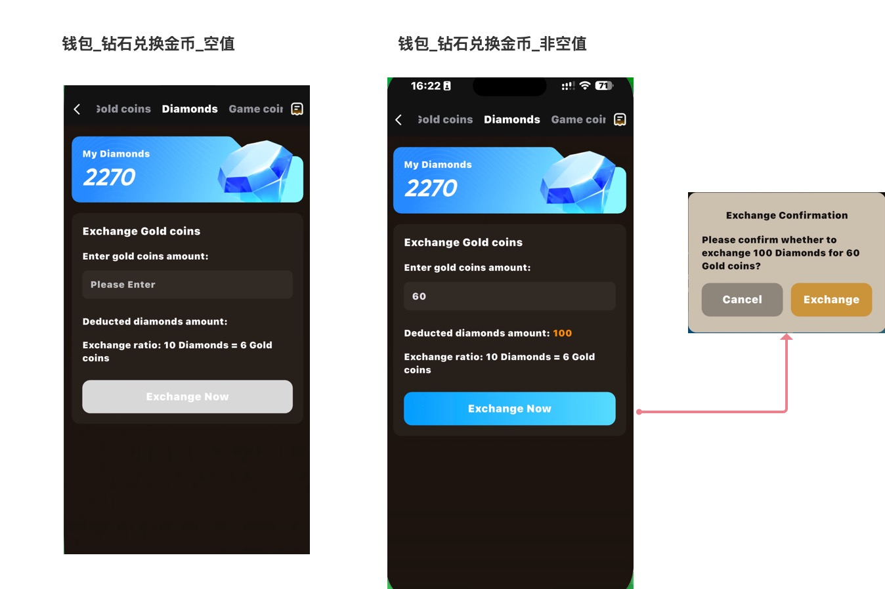

### 6.4.3 前置条件
- 用户已登录
- 当前位于 `Diamonds` 资产页
- 用户账户存在可用钻石余额

### 6.4.4 页面字段定义

| 区块位置 | 字段名称 | 定义 | 统计/计算口径 | 数据来源 |
|---|---|---|---|---|
| 顶部资产卡 | My Diamonds | 当前钻石余额标题 | 固定文案 | 客户端多语言 |
| 顶部资产卡 | 钻石余额值 | 用户当前可用钻石余额 | 读取账户余额 | 客户端账户数据 |
| 兑换卡 | Exchange Gold coins | 兑换模块标题 | 固定文案 | 客户端多语言 |
| 输入字段 | Enter gold coins amount | 用户输入的目标金币数量 | 仅允许输入正整数 | 用户输入 |
| 输入字段 | Please Enter | 输入占位文案 | 空值时展示 | 客户端多语言 |
| 结果字段 | Deducted diamonds amount | 本次兑换需扣除的钻石数 | 按汇率自动计算 | 客户端实时计算 |
| 规则文案 | Exchange ratio | 当前兑换汇率说明 | 固定展示 `10 Diamonds = 6 Gold coins` | 原型 / 客户端文案 |
| 主按钮 | Exchange Now | 发起兑换按钮 | 跟随输入状态切换禁用/可用 | 客户端交互 |

### 6.4.5 统计/计算口径

当前原型、客户端和服务端统一口径：

- `10 Diamonds = 6 Gold coins`

因此：
- 用户输入的是“希望获得的金币数”
- 系统反推需要扣除的钻石数

示例：
- 输入 `60 Gold coins`
- 需扣除 `100 Diamonds`

### 6.4.6 交互逻辑

1. 用户进入钻石兑换金币页。
2. 页面展示当前钻石余额。
3. 用户输入希望获得的金币数量。
4. 页面实时计算需扣钻石数。
5. 当输入合法且可兑换时，`Exchange Now` 按钮点亮。
6. 用户点击按钮后，弹出确认弹窗。
7. 用户确认后提交兑换请求。
8. 服务端校验通过后：
   - 扣减钻石
   - 增加金币
   - 写入双边明细
9. 客户端刷新钱包余额和相关列表。

### 6.4.7 状态定义

| 状态 | 触发条件 | 页面表现 |
|---|---|---|
| 空值态 | 未输入金币数量 | 结果值为空，按钮禁用 |
| 有效输入态 | 输入合法金币数且满足可兑换条件 | 展示扣钻数，按钮可点击 |
| 确认弹窗前态 | 点击主按钮前 | 页面停留在编辑态 |
| 提交中态 | 用户确认后请求中 | 防重复点击，显示 loading |
| 成功态 | 服务端返回成功 | 刷新余额并提示成功 |
| 失败态 | 服务端拦截或失败 | 提示失败并保留输入 |

### 6.4.8 系统后台核心逻辑

- 系统会根据用户输入的目标金币数，按当前兑换汇率反向计算本次需要扣除的钻石数量。
- 在真正执行兑换前，系统会校验这笔兑换是否允许继续，包括用户身份限制、当天兑换限额、钻石余额是否足够，以及是否存在因预支等原因被冻结、不可参与兑换的钻石。
- 如果校验通过，系统会完成一次双边账变：扣减用户钻石余额，同时增加用户金币余额。
- 兑换成功后，系统会同时写入钻石流水和金币流水，保证用户后续在两个明细页中都能追溯这次兑换结果。
- 如果因为冻结钻石或其他限制导致不可兑换，系统会返回明确的拦截结果，供客户端展示对应提示。

### 6.4.9 金币与钻石关系逻辑

| 维度 | 金币 | 钻石 |
|---|---|---|
| 资产定位 | 充值后主要到账资产、消费型资产 | 收益沉淀资产、兑换来源资产 |
| 与对方关系 | 可由钻石兑换获得 | 可按固定汇率兑换成金币 |
| 本版本直接联动 | 充值成功后增加；钻石兑换成功后再次增加 | 钻石兑换成功后减少 |
| 明细联动 | 写入一条“兑换收入”或“充值收入”记录 | 写入一条“兑换扣减”记录 |

补充规则：
- 金币和钻石是两个独立账户，不共用同一余额池。
- 在本版本范围内，两者最直接的关系是“钻石兑换金币”这条单向链路，不支持金币反向兑换钻石。
- 兑换页中，用户输入的是“希望获得多少金币”，系统再按固定汇率反算需要扣除多少钻石。
- 系统实际校验时会同时区分“账户总钻石余额”和“当前可兑换钻石余额”；当存在预支冻结时，可兑换钻石会小于总钻石余额。
- 一次兑换成功后必须同时完成两件事：钻石余额扣减、金币余额增加；并且金币明细与钻石明细都要能追溯到这次兑换结果。

### 6.4.10 异常与测试关注点

这是本页必须补齐的重点：

- 输入不能为空
- 输入必须为正整数
- 需要明确是否仅支持输入 6 的倍数金币数
- 钻石余额不足时必须拦截
- 预支冻结导致可兑换钻石不足时必须拦截
- 达到每日限额时必须拦截
- 兑换成功后需同步刷新金币和钻石余额

---

## 6.5 钻石兑换金币确认弹窗

### 6.5.1 页面定位
用于对本次兑换做最终确认，防止误操作。

### 6.5.2 对应原型
`/Users/mac/心音跳动/TOPKHLIJ/钱包模块/原型图/钻石兑换金币.jpg`


### 6.5.3 前置条件
- 用户已输入有效金币数
- 页面已成功计算本次需扣除的钻石数
- 用户点击 `Exchange Now`

### 6.5.4 页面字段定义

| 区块位置 | 字段名称 | 定义 | 统计/计算口径 | 数据来源 |
|---|---|---|---|---|
| 弹窗标题 | Exchange Confirmation | 二次确认标题 | 固定文案 | 客户端多语言 |
| 弹窗正文 | 兑换确认文案 | 明确展示扣除钻石和获得金币数量 | 组合输入值与计算值 | 客户端本地拼装 |
| 左按钮 | Cancel | 取消本次兑换 | 关闭弹窗，不提交 | 固定按钮 |
| 右按钮 | Exchange | 确认执行兑换 | 提交兑换请求 | 固定按钮 |

### 6.5.5 交互逻辑

1. 用户点击 `Exchange Now`。
2. 弹出确认弹窗。
3. 弹窗正文明确展示：
   - 扣除多少 Diamonds
   - 获得多少 Gold coins
4. 用户点击 `Cancel`：
   - 关闭弹窗
   - 返回兑换页
   - 保留输入内容
5. 用户点击 `Exchange`：
   - 提交兑换请求
   - 进入提交中状态

### 6.5.6 状态定义

| 状态 | 触发条件 | 页面表现 |
|---|---|---|
| 展示态 | 点击主按钮 | 正常展示确认信息 |
| 提交中态 | 点击 Exchange 后 | 防重复点击 / loading |
| 取消态 | 点击 Cancel | 关闭弹窗并保留输入 |

### 6.5.7 系统后台核心逻辑

- 该弹窗只负责承接用户的最终确认，不在弹窗层做真实资产运算。
- 用户确认后，系统才会按页面当前展示的兑换结果执行实际扣减与入账。
- 最终是否兑换成功、实际扣除多少钻石、实际增加多少金币，均以后端校验和结算结果为准。

### 6.5.8 异常与测试关注点

- 弹窗里的扣钻值必须和主页面计算结果一致
- 快速重复点击不得导致重复请求
- 取消后返回原页面时输入内容不得丢失

---

## 七、客户端与服务端联动规则

### 7.1 金币充值链路

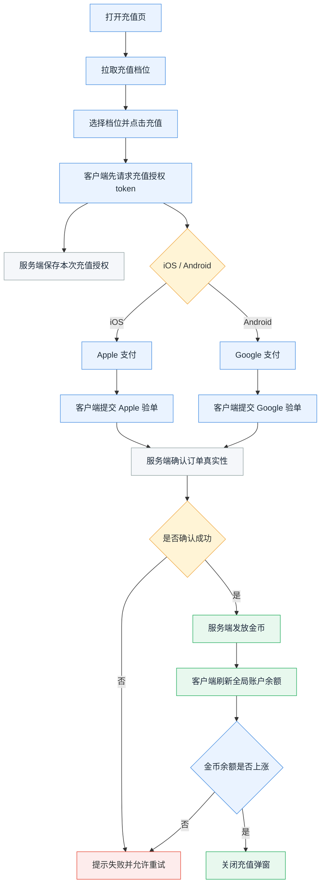

### 7.1AA 第三方充值金币业务流程图

```mermaid
flowchart TD
    classDef user fill:#EAF3FF,stroke:#4A90E2,color:#1F2D3D
    classDef page fill:#F7F9FC,stroke:#95A5A6,color:#1F2D3D
    classDef server fill:#FFF4D6,stroke:#F0AD4E,color:#333
    classDef success fill:#E8F8EE,stroke:#27AE60,color:#1F2D3D
    classDef fail fill:#FDECEC,stroke:#E74C3C,color:#333

    A1[进入第三方充值页]
    A1 --> A2[展示默认国家/地区]
    A2 --> A3[固定套餐区默认展示全部套餐]
    A3 --> B1[选择国家/地区]
    B1 --> B2[页面展示该国家支持的支付方式]
    B2 --> B3[选择支付方式]
    B3 --> C1[页面展示该方式支持的支付渠道]
    C1 --> C2[选择支付渠道]
    C2 --> C3[系统预计算各固定套餐总价]
    C3 --> C4[仅展示总价落在适用区间内的固定套餐]
    C4 --> C5{是否存在可展示套餐}
    C5 -->|否| C6[固定套餐区展示空态]
    C5 -->|是| D1{金额选择方式}
    A3 --> D1
    C6 --> D1
    D1 -->|固定套餐| E1[从当前可展示套餐中选择固定套餐]
    D1 -->|自定义金额| E2[输入金额并点击 Confirm]
    E1 --> F1[确定套餐美元价]
    E2 --> F2[确定自定义金额对应的美元价]
    F1 --> G1[确定支付币种]
    F2 --> G1
    G1 --> G2{是否配置自定义汇率}
    G2 -->|是| G3[直接使用自定义汇率]
    G2 -->|否| G4[使用该渠道返回汇率 × 1.003]
    G3 --> H1[计算本地价格]
    G4 --> H1
    H1 --> H2{固定手续费是否为美元}
    H2 -->|是| H3[将美元固定手续费按渠道汇率换算为本地固定手续费]
    H2 -->|否| H4[直接取本地固定手续费]
    H3 --> I1[按本地价格 × 比例手续费计算比例手续费基数]
    H4 --> I1
    I1 --> I2[比例手续费基数与本地固定手续费共同形成总本地手续费]
    I2 --> I3[计算总价]
    I3 --> I4[按小数位规则取整并刷新价格结果]
    I4 --> J0{总价是否落在适用区间内}
    J0 -->|否| J9[提示 当前金额超出支付渠道适用范围]
    J0 -->|是| J1[点击提交充值]
    J1 --> J2{是否已选择支付方式和支付渠道}
    J2 -->|否| J3[提示 请选择支付方式和支付渠道]
    J2 -->|是| K1[生成待支付订单]
    K1 --> K2[跳转第三方支付页]
    K2 --> L1[用户完成第三方付款]
    L1 --> L2[平台确认订单状态]
    L2 --> M1{是否确认到账成功}
    M1 -->|否| M2[提示失败并允许重试]
    M1 -->|是| M3[发放金币并写入充值记录]
    M3 --> M4[刷新余额和明细]
    M4 --> M5[返回上层场景]

    class A1,A2,A3,B1,B2,B3,C1,C2,C3,C4,C5,C6,D1,E1,E2,F1,F2,G1,G2,G3,G4,H1,H2,H3,H4,I1,I2,I3,I4,J1,K2,L1,M4,M5 user
    class J0,J2,L2,M1 server
    class K1,M3 page
    class K1,M3,M4,M5 success
    class J9,J3,M2 fail
```

### 7.1A 币商售币链路

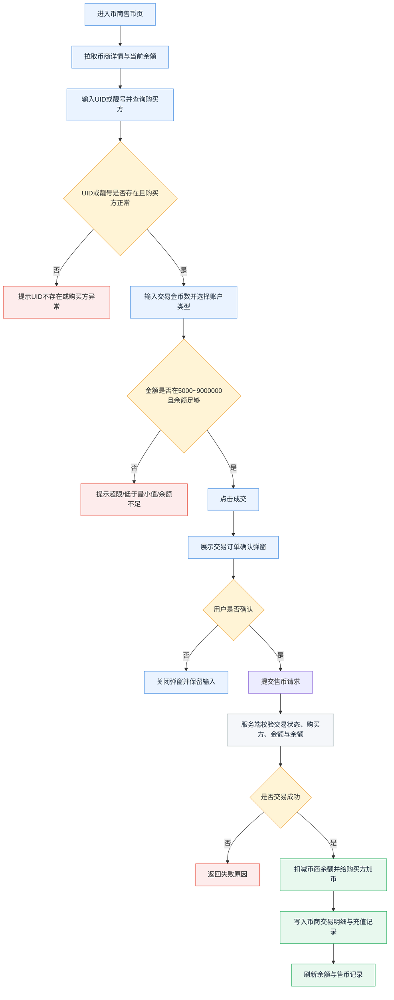

### 7.2 钻石兑换金币链路

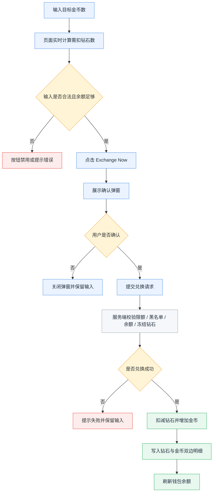

---

## 三、异常与边界规则总表

| 场景 | 处理规则 |
|---|---|
| 充值价格列表为空 | 展示空状态，不允许发起充值 |
| 支付拉起失败 | Toast 提示失败，保留当前档位 |
| 支付成功但验单失败 | 不发金币，允许重试 |
| 同一订单重复回调 | 不得重复发币 |
| 钻石兑换输入为空 | 按钮禁用 |
| 钻石兑换输入非法 | 提示错误，按钮禁用 |
| 钻石余额不足 | 提示余额不足，禁止兑换 |
| 预支冻结导致可兑换钻石不足 | 返回专门拦截结果，并提示用户 |
| 达到每日兑换限额 | 拦截兑换 |
| 明细筛选后无数据 | 展示空状态 |
| 明细页分页到底 | 停止继续加载 |
| 币商售币ID不存在 | 输入 UID 或靓号未命中购买方时，立即 Toast `ID不存在`，不展示购买方信息 |
| 币商售币金额低于 5000 | 拦截成交，提示低于最少卖出限制 |
| 币商售币金额超过 9000000 | 拦截成交，提示已超最大卖出限制 |
| 币商余额不足 | 拦截成交，提示账户可卖出余额不足 |
| 购买方异常/审核用户 | 拦截成交，提示购买方异常，出售失败 |
| 币商交易状态关闭 | 拦截成交，提示您已被暂时禁止交易 |
| 第三方充值未选支付方式和支付渠道 | 不允许提交订单，Toast `请选择支付方式和支付渠道` |
| 第三方充值固定套餐总价不在适用区间 | 该套餐不展示在固定套餐区 |
| 第三方充值已同时选择支付方式和支付渠道后无可用套餐 | 固定套餐区展示空态，允许用户切换支付方式/支付渠道或改走自定义金额 |
| 第三方充值自定义金额总价超出适用区间 | 不允许提交订单，提示 `当前金额超出支付渠道适用范围` |

---

## 四、验收标准

### 10.1 结构验收
- [ ] 金币充值、金币明细、钻石明细、钻石兑换金币均为独立章节
- [ ] 每个页面章节都有独立原型图
- [ ] 不再用旧版合并图混写金币明细和钻石明细

### 10.2 金币充值页
- [ ] 页面能展示当前金币余额
- [ ] 能展示充值档位列表
- [ ] 点击档位后按钮金额同步更新
- [ ] iOS / Android 可正确拉起支付
- [ ] 到账成功后自动收口

### 10.2B 第三方充值金币页
- [ ] 切换国家/地区后，支付方式、支付渠道和价格结果同步刷新
- [ ] 选择支付方式后，仅展示该方式支持的支付渠道
- [ ] 未同时选择支付方式和支付渠道前，固定套餐区默认展示全部套餐
- [ ] 已同时选择支付方式和支付渠道后，固定套餐仅展示总价落在适用区间内（含边界值）的套餐
- [ ] 当前渠道下无可用套餐时，固定套餐区正确展示空态
- [ ] 固定套餐与自定义金额为二选一
- [ ] 自定义金额换算总价超出适用区间时，不允许提交订单
- [ ] 未选择支付方式和支付渠道时不允许提交订单
- [ ] 点击提交时正确 Toast：`请选择支付方式和支付渠道`
- [ ] 选择完整且金额满足区间要求后，可生成待支付订单并跳转第三方支付页

### 10.2A 币商售币与交易记录
- [ ] 币商入口仅在存在币商能力时展示
- [ ] 售币页能展示当前币商余额
- [ ] UID或靓号输入后可正确识别购买方信息；不存在时立即提示
- [ ] 交易金币数按 5000~9000000 边界校验
- [ ] 未填UID、未填金额、未选账户类型时成交按钮不可点击
- [ ] 成交前会弹出交易订单确认弹窗
- [ ] 售币成功后余额与售币记录同步刷新
- [ ] 售币记录页支持全部 / 买入 / 卖出筛选并正确展示日期分组

### 10.3 金币明细页
- [ ] 能正确拉取金币明细
- [ ] 能按日期分组
- [ ] 能展示来源、时间、变动金额、余额
- [ ] 筛选切换生效
- [ ] 支持分页加载

### 10.4 钻石明细页
- [ ] 能正确拉取钻石明细
- [ ] 能展示来源、时间、变动金额、余额
- [ ] 筛选切换生效
- [ ] 钻石兑换后的扣减流水可见

### 10.5 钻石兑换金币页
- [ ] 空值时按钮禁用
- [ ] 输入合法时能实时计算扣钻值
- [ ] 点击主按钮后弹确认窗
- [ ] 确认后双边账变成功写入
- [ ] 余额刷新正确

---

## 五、最终结论

本次钱包模块正式收口为 6 个独立页面模块：

1. 金币充值页
2. 金币明细页
3. 钻石明细页
4. 钻石兑换金币页（含确认弹窗）
5. 币商售币页
6. 币商售币-交易记录页

当前文档已按新版原型完成拆分描述，并保留页面级字段、交互、状态与后台业务逻辑；其中币商模块已额外标注原型目标规则与当前代码主链路差异，避免把预留能力误写成已上线能力。
